Hey there, fellow developers! Today, we’re delving into the fascinating realm of static code analysis, exploring how it can elevate your software engineering project to new heights. We’ll also explore SonarQube, a powerful tool that can be your best buddy in ensuring your codebase is robust and error-free.

# **Understanding Static Code Analysis**

First things first, what’s static code analysis? Imagine it as a digital detective, scanning through your code without executing it. It could sniffs out potential bugs, security vulnerabilities, and areas where your code might not adhere to best practices. In a nutshell, without running the code, it identifies weaknesses and inefficiencies, ensuring your project stands on a solid foundation.

# **What is SonarQube**

Meet SonarQube — the superhero of static code analysis tools. This open-source platform not only identifies issues but also provides comprehensive insights into the overall health of your code. It’s like having a personal mentor who guides you towards writing cleaner, more efficient code.

## **Dashboard**

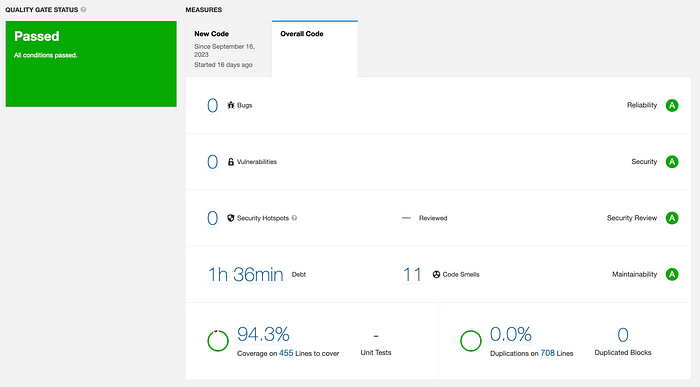

The SonarQube dashboard is the project’s nerve center, displaying a wealth of information at a glance. Here, you get a holistic view of your project’s health, from the number of issues found, bugs, security vulnerabilities, coverage, duplications, code smells, and quality gate status. It provides a bird’s eye perspective, allowing you to make informed decisions. Above is SIASISTEN backend SonarQube dashboard. It tells that the codebas is passed all conditions, as we see the score of the bugs, vulnerabilities, security, code smells, coverage and duplications are green/A.

## **Code Smells Detection**

Code smells are those subtle hints indicating potential problems within the codebase. SonarQube excels at detecting these issues. Whether it’s duplicated code, overly complex functions, or inconsistent naming conventions, SonarQube sniffs out these code smells. By identifying and highlighting these problematic areas, it empowers you to refactor your code, ensuring it’s not just functional but elegant and maintainable.

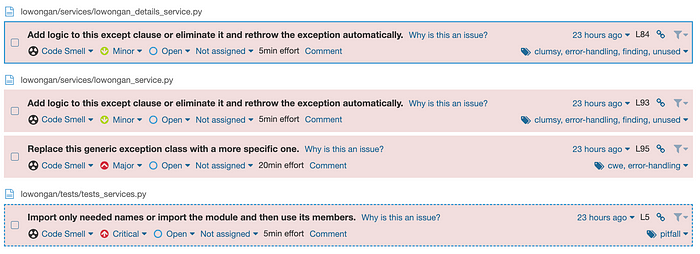

For instance, above is the example of SIASISTEN code smells. It tells on which file and lines that code smells are appear, the priority/critical info, and we can assign each issues to particular dev team.

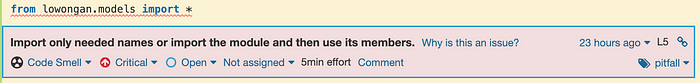

In this example, it tells us that using wildcard \* to import can raise code smells. And the best practice is to explicitly tells the needed class/methods in import statements.

## **Security & Vulnerabilities**

Security is paramount. SonarQube acts as a vigilant guard, scanning your code for security & vulnerabilities. It identifies weak points, helping you to build the shields in the castle against potential threats. SonarQube’s security analysis ensures your software is a fortress, protecting both your data and your users from malicious attacks.

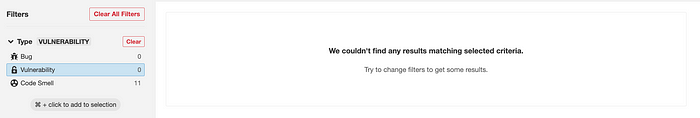

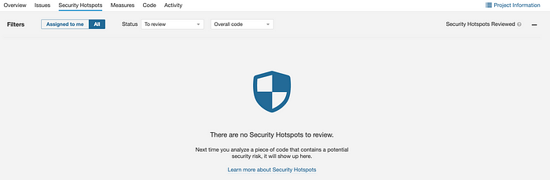

In SIASISTEN SonarQube, it didn’t show any vulnerabilities and security hotspot. It is a good sign right? Definitely.

## **Code Coverage**

Testing is essential, but it’s not just about quantity; it’s about quality too. SonarQube measures your code coverage, revealing how much of your codebase is tested. This insight is invaluable; it helps you identify untested or under-tested portions of your code.

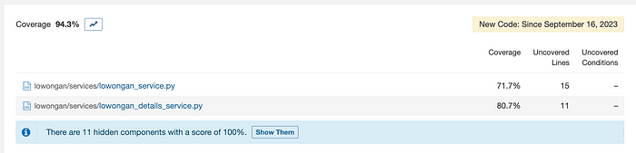

SonarQube will tell in which files are the uncovered code, and how many lines are there. It will give you the bird-eye view on how the test is being tested against the codebase.

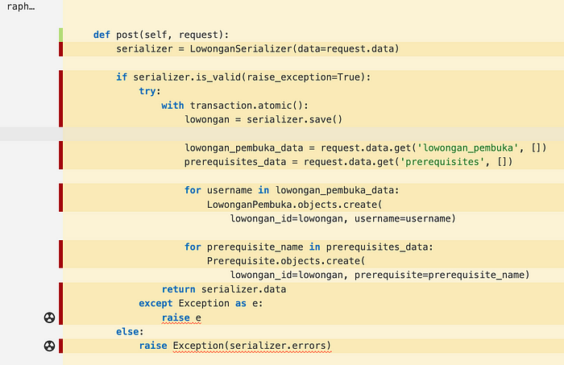

When we open each files, it’s also tells whether the lines of code is covered by the test or not. Green color on the left meaning that line of code already covered by test, while red color indicating that it is not covered by the test.

## **Duplications**

Code duplications can be silent killers of productivity. They could lead to confusion, inconsistencies, and maintenance nightmares. SonarQube’s duplication detection feature identifying duplicated code fragments across the project. By pointing these duplications, it guides you in streamlining your codebase, eliminating redundancies, and enhancing your project’s readability and maintainability.

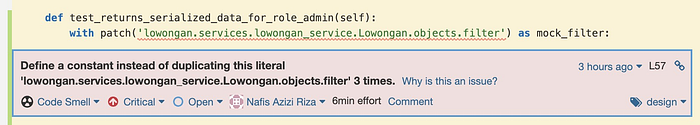

Here’s one of my duplication that catched by SonarQube. It tells me that the patch is being used 3 times somewhere else, and it’s suggesting to define constant instead of duplicating it.

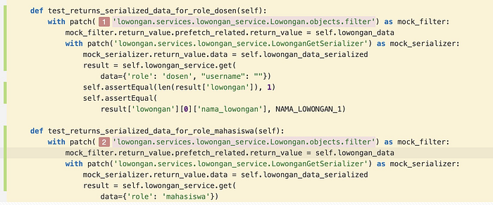

Here we can see the duplicated patch that catched by SonarQube. Then, after knowing the issues, I refactored the code in order to solve them and push it. After you push the refactored code, if you’ve already solve the issues, it will gone.

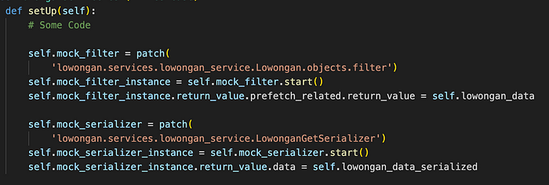

Here’s how I handle the duplications, I created the instance and set the return value of the patch in the setUp, that later can be used by other method in the class.

## **Activities**

The Activities section is your timeline, displaying the changes, issues resolved, and improvements made over time. It’s like a development diary, allowing to reflect on your project’s evolution. By analyzing your past activities, you gain insights into your team’s efficiency, enabling continuous improvement and ensuring your project keeps moving forward.

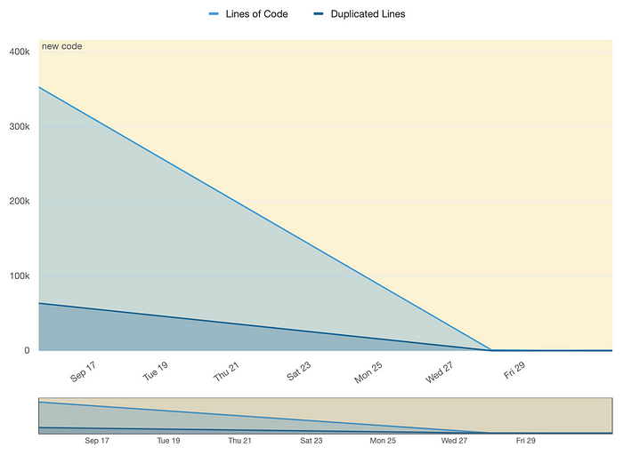

Above is the duplications activity of SIASISTEN. We can see it that the duplications are decreased over the time, meaning that the dev team solved the duplications issues, ensure that the codebase is clean.

# **Experiences & Challenges I Ran Into**

SonarQube has been a great tool for me, and dev team during the development of SIASISTEN. It helps us to detect any issues that might not easy to catch bare eyes. Dev team reminds each other to always comply with the best practice and always try to solve issues raised in SonarQube. However, I faced some challenges as well during the use of SonarQube of static code analysis.

In the current SonarQube server, SonarQube CS is using the Community Edition that won’t able to scan multiple branches for one project. I think it’s quite important to be able to scan in multiple branches since we, dev team, want to make sure that the code goes to dev/staging/production is all well written, issues-free. Then, the way I managed it is to set the scan only in dev branch. By this regulations, everytime dev team merged the MR into dev, the sonarqube will can scan the codebase and display the results. Dev team can refactor their code and create another MR after the issue being fixed.

This solutions is not ideal since every time we try to solve an issues, we don’t know exactly does it already solve the issue, is it raise another issue or not until it merged into dev branch.
