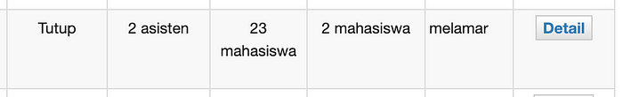

Hello fellow devs and products peeps. In domain of software development, the journey of turning ideas to validating it with users, stakeholders, and mentors is a critical process. It will ensures that the product aligns with the user needs and client’s expectations. Today, we’re diving into how my journey on achieving goals through product validation in the SIASISTEN software development.

# **What is Product Validation?**

Product validation is a process that ensure whether the product is or not addressing the current and potential future users. Basically it’s a bridges the gap between the ideas and the user needs, ensuring that the product not only adresses the current pain points but also anticipates the requirements of potential user. Product validation involves of ideation, where innovative concepts are achieved, followed by compelling pitches to the users, stakeholders, or mentors. The goal is to validate the ideas to be well aligned with the user needs, and client’s expectations.

# **Identifying User Pain Points**

In the initial stages of SIASISTEN development, specifically in the requirement gathering stage, when our client are explaining how was the current system works and highlights on what are need to be improved, I found that there is one pain points that I felt as a user.

Teaching assistants and candidates like myself, were left in a nowhere after applying for positions. Even when the application window had been closed and all positions were filled, our status remained unchanged, that could really resulting into false hopes.

Above is the example of my application on one of the vacancies. The status of “melamar” got me thinking that there might be a chance that the lecturer will open for more positions so that I still have chance of getting accepted. Myself, think that it is a very bad interpretation as its not explicitly said that I got rejected.

# **Pitching to Stakeholders and Mentors**

Pitching the validated idea was crucial. Recognizing the issue above, I proposed the introduction of a rejection status. Engaging with stakeholders and mentors allowed us to refine our solution further. We highlighted the benefits of the rejection status feature. Not only it will provide transparency, but it will also eliminate unnecessary waiting, enhancing user experience significantly. This simple yet very impactful change provided clarity to the users. They will no longer waited indefinitely and unaware of their application’s outcome.

# **Navigating Challenges**

However, every solution comes with its set of chalenges. Our client expressed concerns about few scenarios, such as reconsidering rejected candidates. Addressing this, we believed that the candidate data would be still available and in the system. Lecturers and administrators could still access these records, even if a candidate was initially rejected. So that for this scenario, it can be easily solved.

Another scenario, some of the vacancies received a very high number of candidates. It will make the lecturer and administrator more difficult when they need to reject each candidate that didn’t get accepted. However, this issue can be addressed by adding one button to reject all candidates that not been accepted so that it will save a lot of lecturer and admin’s time.

Therefore, our client finally accept of this idea and it marked a pivotal moment for SIASISTEN. It emphasized the importance of understanding user needs, proposing a viable solutions and collaboratively validating the ideas with the stakeholders.

# **Conclusion**

The successful integration of ideation, validation and implementation of SIASISTEN underscores the essence of product development. Through open communication, understanding the user pain points, and proposing feasible solutions, we transformed a concept and ideas, into a user centric feature.
