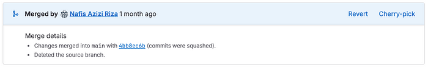
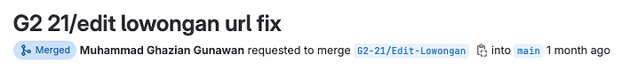
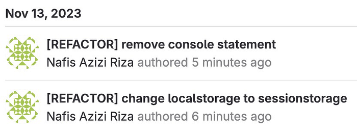
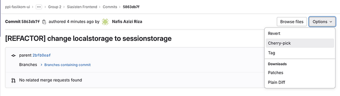
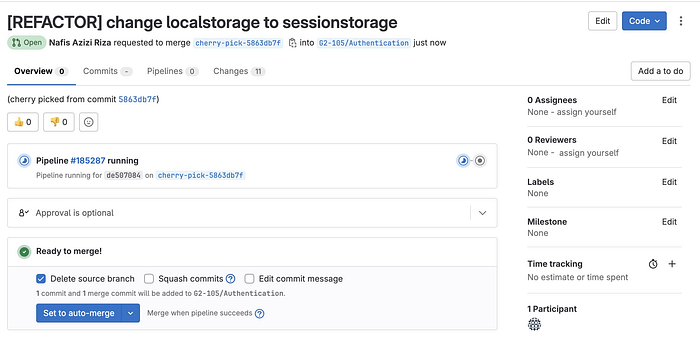
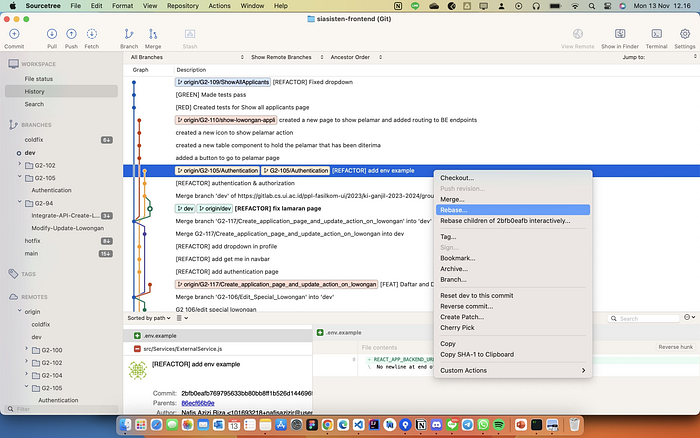
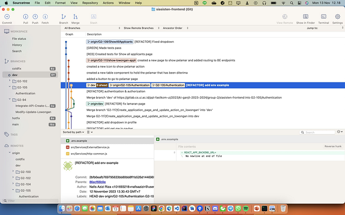
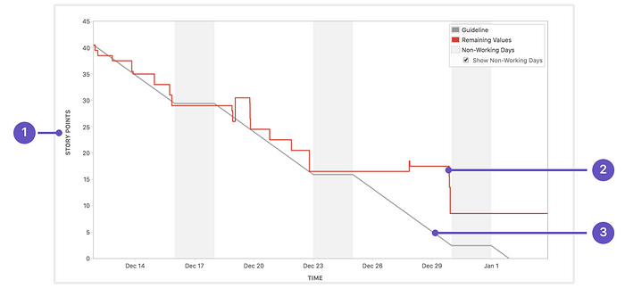

Hey there, fellow devs! Today, we’re going to dive into the advanced tools that I’ve used in my software development project and how we’re using it to supercharge our teaching assistant hiring management platform, SIASISTEN. This article will be the next chapter of the basic tools for the software development essential tools [here](https://blog.devgenius.io/test-driven-development-tdd-one-test-at-a-time-414f280edd64). If you haven’t read it, I’m highly suggesting to do so before going deeper in this topic. In this article, Iwill discuss some of these advanced features, including cherry-pick, revert, stash, burndown charts, and monitoring performance.

# **Revert**

Revert is a git feature that allows to undo a commit. This can be useful if you have made a mistake or if need to revert to a previous version of the code. If you are using CLI, `git revert` command is used to undo a commit. It will creates a new commit that reverses the changes made by the original commit. To revert a commit, simply run `git revert <commit-hash>` .

In gitlab, for each merged merge request, it will have revert and cherry-pick options. In the first sprint, our team members accidentally set the wrong target branch into the main, and the merge request is merged into the main. This such actions could be undo by doing a revert. The button will look like above in the merged merge request.

. Revert main merge request (top).")

Above is example how the revert feature done in our project. In the merged MR, simply click the revert and create a new merge request to revert. Then it could be merged and the main branch will be have the previous (before wrongly merged) version.

# **Cherry-pick**

Cherry pick is a useful tools to apply a specific ommit from one brach to another. This is very useful when merging changes from one branch (PBI branch) into the other branch, staging for example, without actually merging all the changes in the PBI branch into staging. Another scenario, it also could be very useful in fixing bugs in production.

Cherry pick could be applied by running `git cherry-pick <commit-hash>` . If you’re using gitlab, it also provides a cherry-pick features that could be applied as well. For example, after squash the commit in the MR, the merged MR will have cherry-pick options (picture as above) that could be used to be applied in the other branch.

It is important to note that `git cherry-pick` is not the same as `git merge`. `git merge` merges two branches together, which can be dangerous if the branches have conflicting changes. `git cherry-pick`, on the other hand, applies a specific commit from one branch to another, which is a safer option.

# **Rebase**

Git rebase is an advanced Git command that allows to rewrite the history of the commits. This can be useful for integrating changes from one branch into another, or for cleaning up the commit history. When merging two branches in Git, Git creates a new commit that combines the changes from both branches. However, this can sometimes result in a messy commit history, especially if there have been many commits on both branches.

Rebasing, takes a different approach. Instead of creating a new commit, rebasing rewrites the history of the commits. It takes the commits from one branch and applies them on top of the other branch. This can result in a cleaner and more linear commit history.

For example, here I use sourcetree to get the visualization of the branch.

Now, currently I’m in the dev branch (green), and would like to rebase with authentication branch (yellow). We can see that it is from different branch and have different history (not linear). merging authentication to dev will create a new commit/history into the dev branch. However, rebasing did not do that. See the differences below

Now, we can see that now the current condition of the dev branch is at the same commit that we rebase. It does not create a new line and make it linear with the rebase branch. It makes the version control cleaner.

# **Stash**

Stash is a tool that used to temporarily save uncommitted changes. This could be very useful if you would like to switch branches without committing or discard the current changes in the current branch. To use this tools, simply run `git stash` to stash the changes, and `git stash pop` to restore the changes.

If you have multiple stashes, you can use the `git stash list` command to see a list of all your stashes.

# **Burndown Charts**

A burndown chart is a graphical representation of the work that remains to be done on a project over time. It is a useful tool for tracking progress, identifying potential bottlenecks, and forecasting the completion date of a project.

Burndown charts are often used in advanced project management tools such as Jira,. These tools provide features that make it easy to create and update burndown charts, as well as to track other important project metrics such as velocity and cycle time.

Above is example of a burndown chart. Where:

1. Estimation statistic: The vertical axis represents the estimation statistic that you’ve selected.
2. Remaining values: The red line represents the total amount of work left in the sprint, according to your team’s estimates.
3. Guideline: The grey line shows an approximation of where your team should be, assuming linear progress.

If the red line is below grey line, meaning that the team ison track to completing all their work by the end of the sprint. This isn’t foolproof though; it’s just another piece of information to use while monitoring team progress. But, if the red line is above the grey line, it means that the team is behind the schedule, and could lead to potentially not finishing all the backlog for the sprint.

# **Challenges**

Some of those advanced tools are only accessible in paid plans software, well as a **_"broke student"_**, of course we can’t afford that. Additionally where the school do not provide the paid plans for some of those software, we experienced difficulties. During sprint 1–2, we used Jira as our PM tools, but right after sprint 2 finished, the Jira is locked because the free-tier that set up by the TA is already ended. This leaving all of our backlogs, PBIs, burndown charts, and other informations remain locked and can’t be accessed. In the sprint 3, our scrum master choose to use clickup instead.
