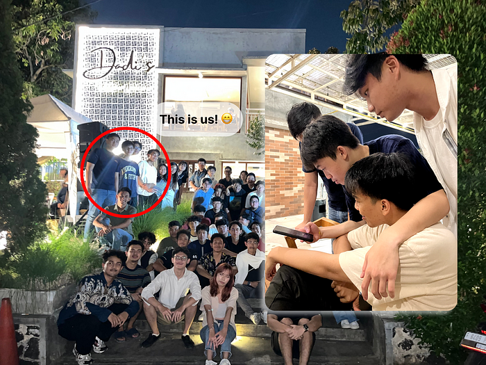
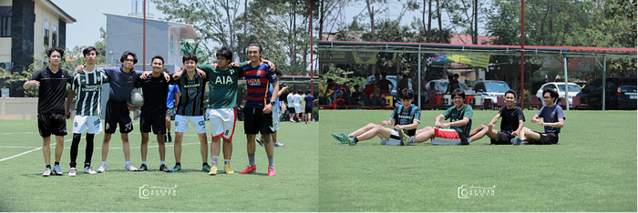
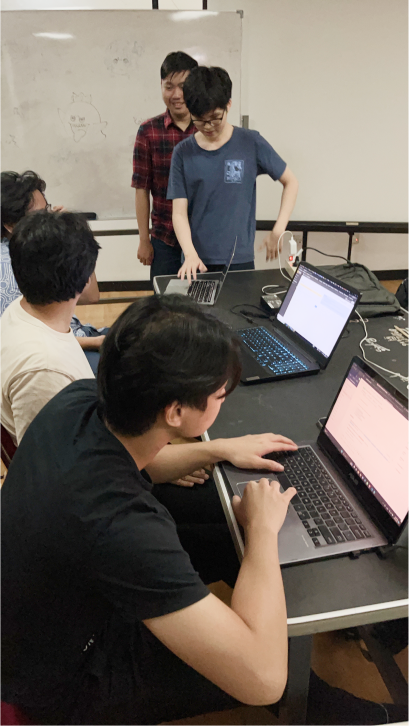
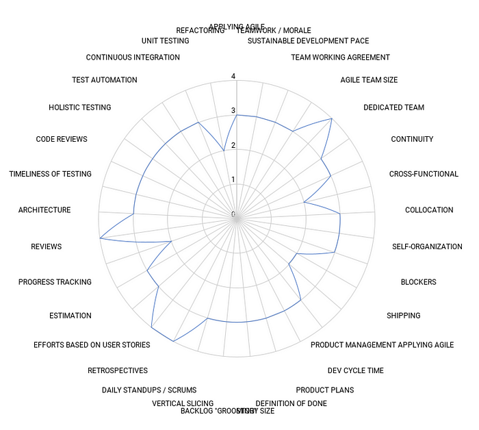

Hi there fellow developers! Today let’s talk about something incredibly important but often overlooked in the software development, the power of people. After all, building a fantastic app isn’t just about code, it’s about the people behind the scene, their connections, relationships, and their ability to work together harmoniously.

# **People Person**

A people person isn’t just someone who interacts well with the others. They are the architects of harmonious relationships, and the bearers of genuine understanding in a team. In both personal and professional lanes, these individuals are the one who are try to connect, to build bridges between gaps and bring out the best in everyone. They are the glue that holds the team together, the empathic listener, and the one who spreads positivity even in challenging times. Being a people person isn’t just about a skill, it’s a profound commitment to understand, support and uplift the people around them. Making the environment more collaborative and inclusive place for all.

# **Making Friends**

Making friends is a very important steps in building positive connections and relationship. With a strong foundation of friendship and trust, the team will can become openly communicate, sharing ideas and work effectively together.

Before the development of SIASISTEN, me and my team have known each other since semester 1, we’ve had plenty of opportunities to hang out and have fun together. This has helped us to build strong relationships and create a positive and supportive team environment.

We’ve gone out for coffee, played games, sports, and just hung out outside of class. Each and everyone of us come from different backgrounds and have our own interests and perspective. This helped us to know each other on a more personal level and learn about each other’s interests, and hobbies. We’ve also started to appreciate each other’s unique strengths and talents.

Getting to know each other outside of class has helped us to build a strong foundation for our team. We now trust each other and feel comfortable communicating openly and honestly. This is essential for collaboration and problem solving.

# **Helping Others**

We believe that helping others is one of the most important things we can do as a team. When someone is struggling with a task, we’re always happy to lend a helping hand. We also take the time to share our knowledge and expertise with each other.

Here are some specific examples of how we have implemented this principle in SIASISTEN development

- During Sprint 1, I helped several team members who were struggling with their tasks, such as writing a test case, applying OO principles, and transferring knowledge for the frontend with React.

- We also conducted in-person coding collaboration during sprint 1. This helped us to work more closely as a team, help each other more quickly and complete our task more efficiently

In addition, we also help each other on a daily basis. For example, we might answer each other’s questions, review each other’s code, or brainstorm solutions together.

Helping others is not only good for the team, but it’s also good for individuals. When we help others, we learn and grow ourselves. We also build stronger relationship and create a more positive and supportive environment. Here are some of the benefits of helping others:

- Improved learning: when we teach someone else something, we have to really understand is to ourselves. This helps us to solidify our own understanding and develop new skills.
- Increased collaboration: helping others build trust. This makes it easier to collaborate and problem solving together.

# **Understanding Others**

We take the time to understand each other’s strengths and weaknesses. This helps us to assign tasks in a way that makes the most of everyone’s skills. It also helps us to be more supportive and understanding of each other.

For example, one of our team members is really good at frontend, but he’s not really comfortable with doing backend work. Another team member is prefer backend over frontend work. When we have a sprint planning, we assign each PBI as a pair of backend and frontend to the members who prefer/good at each areas. Although at some point we need to do the other areas that we’re not preferred/good at, but this approach could really helps us.

When doing a pair work, each person will be a very good at one, and when doing a swap each of them could really utilize the knowledge transfer to each other and this will keep the team dynamic in a more efficient way.

Understanding each other’s strengths and weaknesses also helps us to be more understanding and supportive of each other. For example, if someone is struggling with a task, we know that it’s not because they’re not capable. It’s simple because they need more time or support.

# **Bring Joy and Productivity**

In addition to building relationships and understanding each other, it’s also important to be able to bring joy and productivity to the team. This can be done by:

- Creating a positive atmosphere: this can be done by being encouraging, supportive, and always looking for the silver lining.
- Being motivated: this can be done by setting clear goals and staying focused on achieving them.

We try to create a positive atmosphere in our team by being supportive of each other and celebrating our successes. We also like to have fun and make each other laugh. This helps us to stay motivated and focused on our work.

During challenging times in the development process, our team members kept the spirits high. We motivated each other and turned obstacles into learning opportunities and infused our team with enthusiasm.

# **Scrum Maturity Assessment**

Scrum maturity assessment is a process of evaluating how well a team is implementing Scrum principles and practices. It helps to identify areas where the team can improve and to track their progress over time.

Above is example of how the siasisten team scrum assessment. We can see that the score range for each competencies is 0–4, where:

- 0 (INITIAL) The team lacks consistency and needs training to get all team members aligned.
- 1 (JUST STARTED) The team has a basic level of Agile adoption. Team Agile processes are not fully defined. Dev and QA are not yet fully in sync.
- 2 (DEFINED) The team is applying well-defined Agile processes and are consistently delivering each sprint.
- 3 (MEASURED) The team is measuring code quality and other key indicators. Primary focus is on engineering / development maturity.
- 4 (OPTIMAL) The team is developing on-schedule for each release. They are successfully applying Agile methods: self-organized, adaptive planning, sustainable, continual improvement, and are applying automation for perpetual integration and deployment.

From the graph, we can see that some of the competencies need to be improved, and some of them are already good. In our team, there are still lot of room for improvement.

# **Conclusion**

Being a people person is an essential skil for software engineers. By building relationships, understanding others and bringing joy and productivity to the team, we can create a positive and productive environment where everyone can thrive.

Here are some specific examples of how we’ve implemented these principles in SIASISTEN:

- We have a team chat where we can share ideas, ask questions, and offer suport anytime
- We have two daily meetings in a week where we discuss our progress and bottleneck during the development.
- We have a no-judgement zone, where everyone feels comfortable sharing their ideas, even if they’re not dully formed.

As sometimes it’s not easy to always keep the team’s dynamic high since we have our own backgrounds and priorities, but we’re always loking for ways to improve our team dynamics. We believe that by continuing to build relationships, understand each other and bring joy and productivity to the team, we can create a successful and fulfilling experience for everyone involved. Cheers!
