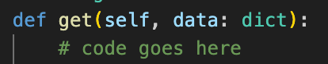

Hey there, fellow devs! Today, we’re diving deep into the world of programming best practices, object-oriented programming principles, and SOLID principles. Exploring guidelines and principles that will not only make your code understandable but also maintainable. Let’s unravel the secrets to writing impeccable code!

# **Best Practice Programming**

Best practice programming is a set of proven techniques, methods, and design principles that experienced developers have discovered over years of trial and error. These practices ensure your code is readable, maintainable, and efficient.

## **Naming Convention**

**1. Class names should be nouns and normally use the CapWords convention.**

When it comes to naming in programming, consistency and clarity are the key. Class names should be chosen as nouns, reflecting the essence of the object they represent. For example, a class representing a Lowongan Details Service could be named `LowonganDetailsService`. This makes it instantly clear what the class is about.

**2. Function and variables names should be lowercase_with_underscores as necessary to improve readability. Function must be verbs and plural form should be used on names representing a collection of objects.**

Functions and variables are the workhorses of your code. They should be named in a way that clearly indicates their purpose. Use lowercase_with_underscores to separate words, enhancing readability. When naming functions, use verbs to represent actions.

For instance, a function in `LowonganDetailsService` that is responsible to get the data might be named `get()`. This makes it immediately evident that the function performs a get data.

When dealing with collections of objects, like lists or arrays, use the plural form in the naming. This indicates that the variable contains multiple objects. For example, if you have a list of lowongan, name it `lowongan_data` rather than `lowongan`, making it clear that it’s a collection. Make sure to use `lowercase_with_underscores` styles as well. Maybe this example is a bit unclear since lowongan is not an English words. Another examples for the plural could be `books` to store a collection of book, instead naming the variables to `book` which is singular.

**3. Constant names must be all UPPERCASE_WITH_UNDERSCORES.**

Constants, values that do not change during the program’s execution, serve as important reference points. To distinguish them, use all `UPPERCASE_WITH_UNDERSCORES` . For example, a constant representing the name of lowongan instance could be named `NAMA_LOWONGAN_1`.

**4. Boolean variables/methods should be named to sound like booleans.**

Booleans represent true/false values. When naming variables or methods that return boolean values, make sure the names sound like booleans. For instance, a boolean variable indicating whether a lowongan is special or not, might be named `is_special` , and method that responsible to check whether a lowongan has `syarat_tambahan` or not might be named `has_syarat_tamabahn()` which will return boolean true/false as well.

## **Statements**

Be explicit! Instead of using wildcards, list out your imported classes explicitly. It might seem like a hassle, but it avoids confusion and keeps your codebase clean.

Examples above is the bad import statements, it used wildcards `*` to import everything in `lowongan.serializers.lowongan_serializer` . This can cause confusions for other developers to read, also it might confuse the dev who wrote the code itself since they don’t know explicitly what classes/methods they should use.

Instead, explicitly typed all the necessary import can avoid those confusions. In this example we know that from `lowongan.serializers.lowongan_serializer` we imported `LowonganSerializer, LowonganPembukaSerializer, PrerequisiteSerializer` and `LowonganGetDetailsSerializer` .

## **Comments**

Comments should be like tour guides, providing insights where needed. If a complex algorithm is at play, a comment explaining the logic can be invaluable. However, remember, a well-written code is almost self-explanatory. Comments should only be used where the code isn’t immediately clear.

Above is the example on how comments can be implemented. The dev teams are not familiar with built-in Django ORM such as `prefetch_related` , so that it is necessary to write the comment on what is exactly those lines of code does. Also, the second comment is about adding one more filed into Lowongan object. Lowongan models does not explicitly said that it has lowongan_pembuka fields, since it is stored in different tables. But after joining with LowonganPembuka tables, Lowongan object now have lowonganpembuka_set.all fields that contain the set of all pembuka/recruiter for a particular lowongan. I would like to introduce a new field that need to be included in the response and I put the comment so that the other devs can easily understand what I was trying to achieve.

## **Simple and Effective Functions**

The principle of Simple and Effective Functions advocates for functions that do one thing and do it well. When a function has a clear and specific purpose, it becomes a reusable and predictable tool in your codebase. By avoiding side effects and ensuring that functions have minimal dependencies, you enhance their effectiveness. Simple functions are easy to understand, test, and debug, making the codebase more robust and developer-friendly. Embracing this principle not only streamlines code but also fosters a modular approach, allowing to compose complex behaviors from simple, well-defined functions.

Above example is a function that is responsible for one and only which to get the details of a lowongan. This function promotes easy to understand by other devs, easy to test, and easy to debug as well.

## **Don’t Repeat Yourself (DRY Principle)**

DRY emphasizes the importance of reusability and modularity by encouraging developers to avoid duplicate code. When you find yourself copy-pasting chunks of code, it’s a signal that you should create a function or a class, promoting code reuse and reducing redundancy. DRY not only enhances maintainability but also improves readability, as developers can focus on the unique aspects of each component rather than sifting through repeated code.

For instance, instead of I patch the values when getting the distinct values of semester and tahun_ajaran in every test suite. Here I put them in `setUp()` so that the other method can use it directly and reduce redundancy in writing code.

## **Secure Your Code**

Security matters. Avoid hard-coding sensitive information like database credentials. Instead, use .env files to store them securely. It’s a simple step that goes a long way in keeping your application safe from prying eyes.

For instance you could use `.env` to store confidential information. env variables use key=value pairs that can be used as below in the python app:

And please don’t forget to put your `.env` in the `.gitignore` to avoid adding the `.env` file into your git commit.

# **Best Practice in Django Rest Framework (DRF)**

## **Versioning APIs**

It is important to implement API versioning from the beginning of the development to handle the application as it evolves to a bigger project. API can be evolve into much more complex as the requirements changes and versioning the API can be very useful and powerful to handle this such issues.

## **Serialization for Data Representation**

Serialization

Django app are not to be able to return native Python data types, hence it needs to be converted into another format such as JSON. It is important to serialize to convert any Python object into other format and Django provides serializers to convert to convert this native data types and control the output efficiently. Above is the example of the implementation of serialziers. Serializers can be generated to map all the fields in the model or just to return the response for specific fields.

## **Authentication and Permissions**

Authentication and permission used to validate that the API are accessed only the authenticated users. This can ensure that the information or the response that will be given is valid only the authenticated users. This can be done by adding the JWT token in the authentication header of the request.

## **Optimizing Database Queries**

DRF provides built-in ORM queryset optimization techniques to avoid costly computation when querying the database. For example, this can be done by select_related and prefetch_realted. prefetch related is used to follow the FK of a model.

This can be avoid any operations that needs to join two models/tables and in Django it’s optimized rather than joining the table itself.

## **Unit Testing for API Endpoints**

Add every API with unit testing to validate the functionality of the API. A comprehensive unit test is needed in order to ensure that the APi is robust and bug free.

## **Uniform Response Output**

Provide uniform response

By providing the uniform response, any application that need to call API request to the backend will be easily handle the response since all of them have the uniform response pattern. In this app, we create two patterns when the response is success or error.

# **Object-oriented Programming Principles**

Object-Oriented Programming (OOP) is a programming paradigm that introduces a novel way of structuring code. OOP takes an approach by organizing operations and data into modular units called objects. These objects can interact with one another, forming structured networks that constitute a complete program.

## **Abstraction**

Abstraction is like looking at an object from a distance. You don’t need to know all the intricate details; you just need to understand what it does. In programming, abstraction allows to hide complex implementation details and show only the necessary features of an object. Abstraction simplifies the programming process, making it more intuitive and manageable.

## **Encapsulation**

Encapsulation is like putting the code in a box and giving it a label. It bundles the data and methods that operate on the data into a single unit known as a class. By encapsulating data, you protect it from unauthorized access and modification. It promotes modularity, allowing different parts of the code to function independently without interfering with each other.

For instance, `LowonganDetailsService` class handles the encapsulation of data and methods related to lowongan details. The methods `get`, `put`, `delete` are encapsulated within the class `LowonganDetailsView`.

## **Inheritance**

Inheritance is the family tree of programming. Just like we inherit traits from our parents, objects and classes in programming can inherit properties and behaviors from other objects and classes. It promotes reusability, allowing you to create a new class based on an existing class.

For instance, `LowonganDetailsView` class inherits from the `APIView` class. In Django REST Framework, views that inherit from `APIView` are used to handle HTTP requests. The `APIView` class provides the basic structure for handling different HTTP methods like GET, POST, PUT, DELETE, etc., and it is typically used as the base class for custom API views.

## **Polymorphism**

Polymorphism allows objects of different classes to be treated as objects of a common superclass. In simpler terms, it enables a single interface to represent different underlying forms. Polymorphism allows to write flexible and scalable code. Polymorphism enhances the extensibility and maintainability of your code, making it easier to add new functionality without altering existing code.

# **SOLID Principle**

SOLID is an acronym representing a set of five design principles in object-oriented programming that promote software development practices emphasizing readability, maintainability, and extensibility. Each letter in SOLID stands for a specific principle:

## **Single Responsibility Principle**

This principle states that a class should have only one reason to change, meaning it should have only one job or responsibility within the software system. By adhering to SRP, classes become more focused and easier to understand, modify, and maintain.

The `LowonganSerializer` class have a single responsibility: serializing instances of the `Lowongan` model. It takes care of converting complex data types, like queryset and model instances, into native Python datatypes. So, it adheres to the Single Responsibility Principle.

## **Open Closed Principle**

The Open Closed Principle suggests that software entities should be open for extension but closed for modification. In other words, it should be able to add new functionality to a system without changing existing code. This promotes enabling easy additions without altering the existing, working code.

`LowonganSerializer` is open for extension, but closed for modification. `LowonganGetSerialzier`extends the functionality of `LowonganSerializer`by adding extra fields without modifying the existing behavior.

## **Liskov Substitution Principle**

LSP asserts that objects of a superclass should be replaceable with objects of a subclass without affecting the correctness of the program. In practical terms, this means that derived classes must extend the behavior of the base class without altering its properties, ensuring seamless substitution of objects and preventing unexpected behaviors.

`LowonganGetSerializer` inherits from `LowonganSerializer` without changing its behavior. Therefore, LSP is maintained.

## **Interface Segregation Principle**

ISP dictates that a client should not be forced to depend on interfaces it doesn’t use. In essence, it encourages the creation of specific, client-focused interfaces rather than large, general-purpose ones. By adhering to ISP, you prevent clients from being burdened with unnecessary methods, making the system more modular and adaptable to changes.

## **Dependency Inversion Principle**

DIP emphasizes the importance of high-level modules not depending on low-level modules, but both depending on abstractions. By relying on abstractions, changes in one module won’t directly impact other modules, promoting flexibility and maintainability.

# **Challenges We Ran Into**

During the development of SIASISTEN, we’ve encountered on some issues regarding the best practices, OOP principles and SOLID principles.

One of the dev team member doesn’t apply best practice programming yet on the explicit import statements. And the way we try to resolve this issue is by reminding the other dev to always comply with the best practice programming, check and resolve issues that raised in the sonarqube.

The other one, due to unfamiliarity with view-service separation from the dev team member, `LowonganView` class seems violates SRP since it handles multiple things: request, business logic. Therefore, I tried to introduce them the separation of view-service so that view class should only handle the request and delegate all the complex business logic into service. They refactored the code into view-service.

# **References**

[PEP 8 - Style Guide for Python CodePython Enhancement Proposals (PEPs)](https://peps.python.org/pep-0008?source=post_page-----ca1527f1cf3d--------------------------------)

https://studygyaan.com/django/django-rest-framework-best-practices-for-building-powerful-apis
