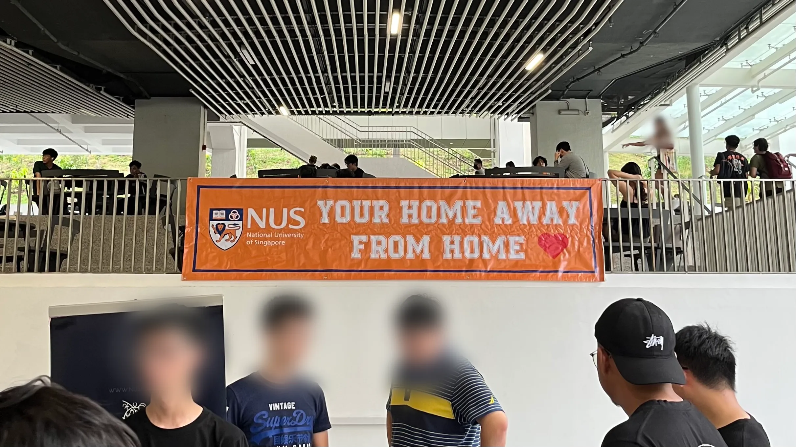
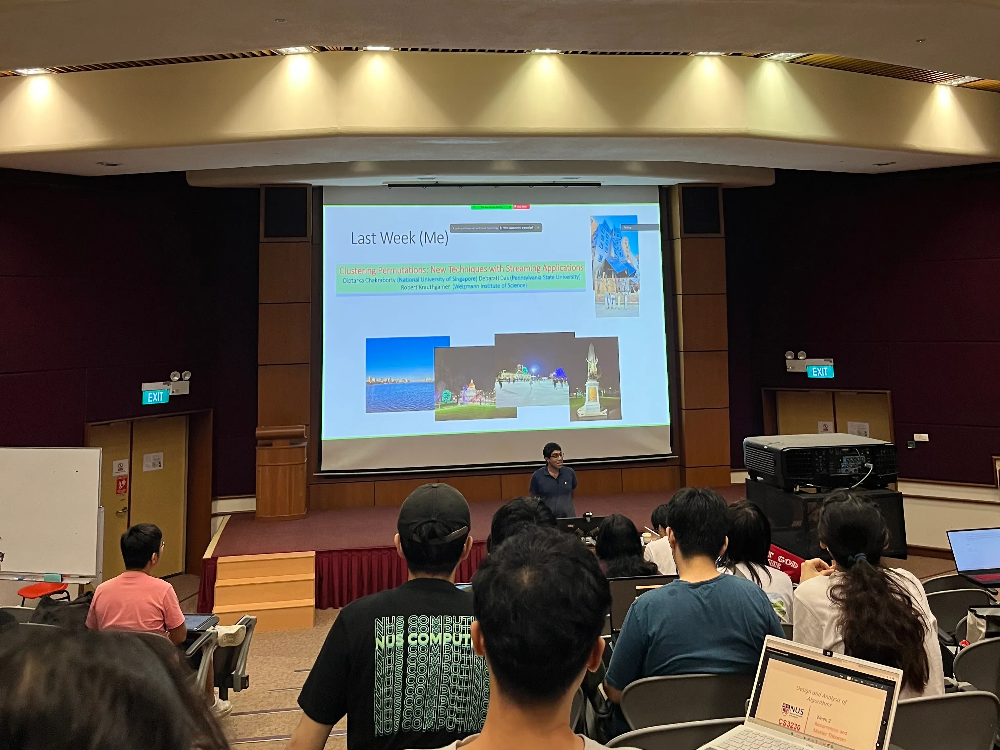
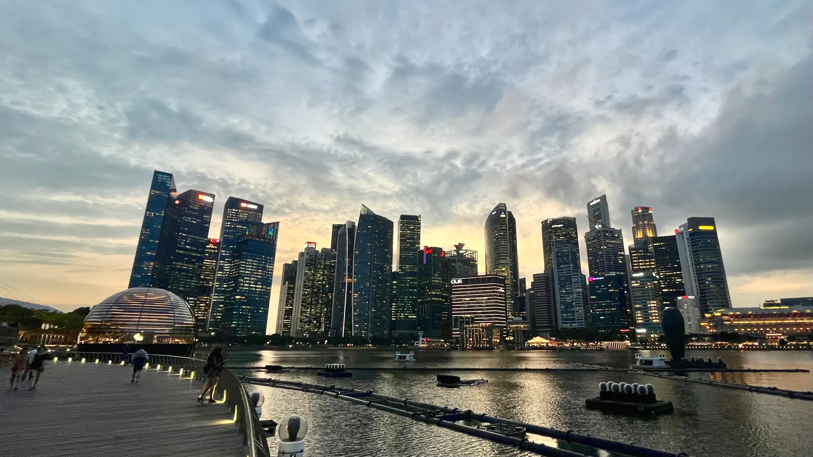

Go grab a cup of coffee ☕️, find a cozy spot to settle in for a captivating read coz it will be quite a long post. I’m about to take you on a journey through my incredible exchange experience on **National University of Singapore (NUS)** last semester. As long as it’s interesting, it’s full of anecdotes, insights and ideas that I hope will inspire and entertain you. Let’s dive in!

Recently, the [QS World University Rankings 2024](https://www.topuniversities.com/university-rankings/world-university-rankings/2024) have just been released and NUS was ranked **8th** in the world! Making it’s remarkable achievements by being the only institution from Asia that sits comfortable in the top 10 😱.

As some of you may know, last semester I had the opportunity to do an exchange in NUS, Singapore as part of my Computer Science study in Universitas Indonesia. I was beyond grateful to be the part of NUS School of Computing, where the CS program was ranked 6th in the world!! And let me tell you, it was **_an experience like no others_**!

# **How it’s started?**

From the instant I set foot on the vibrant and bustling NUS campus, I knew I was in for a memorable adventure. The sheer variety of cultures, perspectives, and thoughts changed into certainly awe-inspiring. Whether it become collaborating with superb minds from every corners across the globe or carrying out thought-scary discussions, each day changed into an adventure in learning and growth.

During the program, I had the chance to dive deep into cutting-edge CS mods *(yes, they call it as modules, mods/mod in short, instead of course)*, and one module as my most remarkable and favorite — **Design & Analysis of Algorithms**. Let me tell you, this module was **_no walk in the park!!_** 😅 Me and other fellow exchangers really struggled and that’s exactly what made it so memorable. It pushed us into our limits and challenged us in ways we never thought possible.

The module was delivered by duo combo Prof. Diptarka and Prof. Steven. Where they combined their extensive experiences to deliver the contents in delving deep into the underlying principles of algorithm design & analysis and giving us with hands-on coding 👨🏻‍💻 problems of theory we’ve learned in class. The overall teaching styles kept me engaged and inspired, even during the most challenging moments. I’ll admit, I sometimes low-key find myself missing those moment when I was **struggling to get an “AC” (Accepted)** in the contest server 🤪. *It was a true perseverance and problem-solving skills.*

## **Everyone’s Question: Why Singapore?**

But it wasn’t just about the academics! It was a true holistic journey that encompassed my personal growth and unforgettable memories. Probably it’s everyone’s question: **_Why Singapore? It’s so close!_** Well, that’s what made it more interesting. While it’s geographically 🌏 close, Singapore offers a unique experiences that sets it apart. This small country that just 45 minutes ferry ⛴️ away from Batam, Indonesia, is a place where different cultures coexist harmoniously creating a diversity that is truly fascinating. From savoring deletable dishes from various ethnic cuisines 🍽️ — oh God, while writing this, I’m literally craving for prata from our favorite supper place, **_Niqqi’s Cheese Prata Shop_**, where it’s only ±2 minutes walk from where I stayed — to witnessing colorful 🎨vibrant festivals.

> Singapore offered me an opportunity to broaden my horizons and embrace the richness of its multicultural.

I discovered that Singapore is not only a vibrant cultural melting pot but also a modern and cosmopolitan city. In many ways, it embodies the **western essence of Asia**. Though I have yet to visit the western part of the world 🤪, fellow exchangers from the West confirmed this observation.

# **The friendships and adventures**

Moreover, the friendships I’ve made during this program are **invaluable‼️** I had the privilege of meeting people from **_all over the world_** 🌍🌎, and together we shared laughs, late night study sesh, and even a short getaways to nearby countries during weekends and breaks.

We hopped on adventures that pushed the boundaries out of our **_comfort zones_** and unlock some **_new skills 🧗🏻‍♂️🏄🏻‍♂️_**. From conquering the peak of mountains and embark on a thrilling loop that offered a scenic panoramic views, to unforgettable island hopping experiences, complete with a vibrant coral reefs and pristine beaches 🏖️ with turquoise crystal clear waters. **We truly lived on an adventure of a lifetime.** These shared experiences not only strengthened our friendship, but also allowed us to tap into our adventurous spirit and discover newfound strength within ourselves.

I took an opportunity to introduce my friends to my very lovely and beautiful country, **Indonesia** 🇮🇩. We jumped on unforgettable adventures to Bali and Lombok, where I showcased that Indonesia itself is a **very rich in cultures**, have breathtaking natural landscapes, and the most important one, the mouth watering cuisines 🍛. I took them to local **_warung_** where we had **_Nasi Padang, Soto, and Penyetan_** 😆. But I didn’t stop there — I proudly introduced them to my hometown, **Surabaya**, and took them on a tour around the “_city of heroes_” 🦈🐊. The bonds we created **transcended borders**, and I’m grateful for the **lifelong connections I made** 🤝🏻.

> There are too many pictures of the trips and I couldn’t pick the best one :\ So I’ll just leave it blank here

As I reflect on my exchange experiences at NUS, I can’t help but feel immense **pride** in being associated with such a prestigious institution.

Before I wrap this story, I want to extend my **heartfelt gratitude** to everyone who made this journey so *remarkable* and *memorable*. To **NUS**, thank you for creating an exceptional academic environment and providing such a great exchange program. To **my friends** and **fellow exchangers**, you’ve been my rock, my inspirations, and my partner in crime. Thank you for the countless shared adventures, being in the dining hall for all the convos and lots of movie nights, and of course, the bond of a lifetime. To **my family**, thank you for believing in me and encouraging to seize every opportunity that comes my way. Your love and support always been my driving force. This incredible chapter of my life wouldn’t been possible without y’all.

Here’s to the **memories** we’ve created, the **lessons** we’ve learned, and exciting **journeys** that lie ahead. *Cheers to each and every one of you!* 🥂🍻
