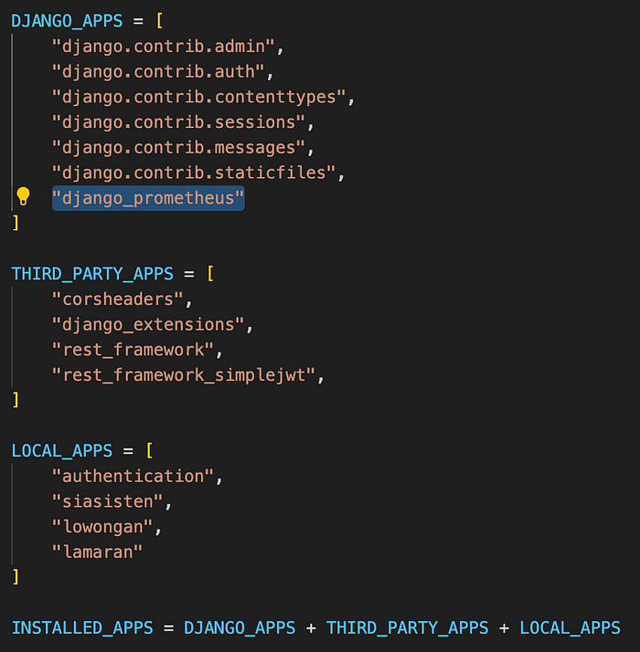
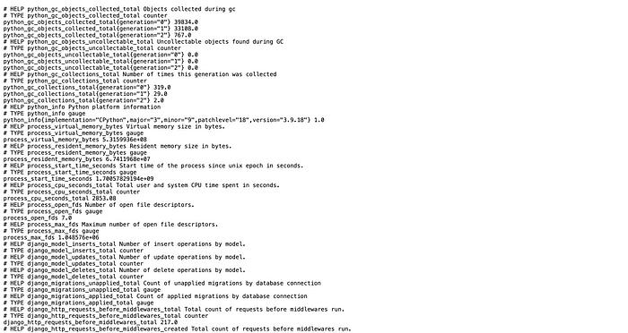

Hello fellow developers! Today, we’re going to explore one of the most important topic after your application deployed into production, which is platform monitoring!

# **Why we should monitor out platform?**

Platform monitoring plays a pivotal role, providing valuable insights into system health and enabling easy troubleshooting to prevent potential issues. In the context of SIASISTEN, a teaching assistant hiring management application, implementing platform monitoring with Prometheus and Grafana offers a comprehensive solution to achieve these objectives. It could help us to know the current health of the platform, see the log message and debug if there is any bug/errors that occur in the production.

# **Prometheus**


Prometheus is an open-source monitoring system that collects and stores time series data. It regularly scrapes metrics from the servers, applications, or another services, and will store them in a time-series database. This data can then be used to identify trends, troubleshoot problems, and make informed decisions about how to improve the performance of the systems.

Prometheus offer a lot of flexibility, and their key features include:

- Prometheus stores metrics as **time series** data, which means that it keeps track of the value of a metric over time. This makes it possible to identify trends and patterns in your data.
- Prometheus uses a query language called **PromQL** to query its time series data. PromQL is a powerful tool that allows to filter, aggregate, and transform your data.
- Prometheus can be used to generate **alerts** when certain conditions are met. For example, you could set up an alert to be triggered if the CPU utilization on a server goes above a certain threshold we set.

# **Setting Up Prometheus in Django REST Framework**

Before using Prometheus, the django app should be able to expose the metrics and make it available to the other parties. In django, we can do that by installing django-prometheus. This can be done by simply installing the django-prometheus with command `pip install django-prometheus`

Add the django_prometheus in the installed apps in the core/settings.py



```
MIDDLEWARE = [
    'django_prometheus.middleware.PrometheusBeforeMiddleware',
    ...
    'django_prometheus.middleware.PrometheusAfterMiddleware',
]
```

Finally, put the url of the prometheus in the urls.py

```
urlpatterns = [
    path('api/', include([
        ...
        path('prometheus/', include('django_prometheus.urls')),
    ])),
]
```

That’s it!, now we can see the metrics in the /prometheus/metrics



After setting up the prometheus in the application, now we need to be able to dockerize the prometheus with the other container. This could be done easily using docker-compose.

Add this inside your service in the docker-compose:

```
prometheus:
    image: prom/prometheus:v2.37.9
    container_name: prometheus
    ports:
      - 9090:9090
    command: "--config.file=./prometheus.yml"
    volumes:
      - ./prometheus.yaml:/etc/prometheus/prometheus.yml:ro
      - ./data:/prometheus
    restart: unless-stopped
```

It will use port 9090 to be able to expose the prometheus metrics from the application. In the server, we need to add the prometheus.yml for the config file of the prometheus:

```
global:
  scrape_interval: 15s
  evaluation_interval: 15s

scrape_configs:
  - job_name: monitoring
    metrics_path: /prometheus/metrics
    static_configs:
      - targets:
          - <docker_image_app>:8000
```

It will set the target of the prometheus to check from the docker container app with the path /prometheus/metrics as we already defined in the app.

# **Challenges**

Theoretically, when running the docker image, the prometheus in port 9090 should be able to run. However, the server won’t allow to expose port 9090 to public and it’s require more knowledge to setting up this. Hence, we are not able to see the deployed prometheus in port 9090.

# **Grafana**


Grafana is an open-source visualization tool that allows you to visualize the data collected by Prometheus. Simply put, prometheus will get the data, and grafana will display it to you. Grafana can create a variety of charts, graphs, and dashboards, which can be used to monitor the systems and applications.

Grafana offers features such as:

- Can **connect to a variety of data sources**, including **Prometheus**, Graphite, InfluxDB, and Elasticsearch.
- Grafana allows to create custom dashboards that combine multiple charts and graphs. Dashboards can be shared with others, so that everyone can stay informed about the health of the systems.
- Grafana can display alerts from Prometheus and other data sources. This allows to see all of your alerts in one place.

# **Implementing Platform Monitoring in SIASISTEN**

Implementing platform monitoring into SIASISTEN involves several key steps:

1. Instrument the application code to expose relevant metrics that provide insights into its performance and health. This may include metrics such as response times, error rates, and resource utilization.
2. Deploy Prometheus as a service or container within the SIASISTEN infrastructure. Configure Prometheus to scrape metrics from the instrumented application and other relevant sources, such as application servers, databases, and load balancers.
3. Install and configure Grafana as a separate service or container. Connect Grafana to Prometheus as a data source, allowing it to access the collected metrics.
4. Design and create dashboards in Grafana to visualize the collected metrics. Use various graph types, such as line charts, bar charts, and heatmaps, to effectively represent the data.
5. Configure alerts based on specific metrics thresholds. These alerts will notify the appropriate personnel when potential issues arise, allowing for timely intervention and resolution.
