In the fast-paced world of software engineering, teamwork and the right tools can be the difference between chaos and success. Developing a teaching assistant hiring management app, SIASISTEN, has taught me that leveraging essential tools not only optimizes our workflow but also empowers us to deliver efficient solutions. In this article, I’ll take a casual stroll through the tools that have become our secret sauce for team collaboration and productivity.

# **Gitlab**

First on our list is GitLab, a web-based platform that acts as our trusty sidekick in managing software projects. It seamlessly combines Git repository management, issue tracking, continuous integration and deployment (CI/CD), code review, and documentation. Think of it as our project’s home base, where everything starts.

## **Commit Messages**

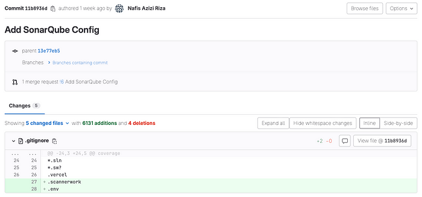

GitLab’s commit messages are our guiding breadcrumbs. These messages are more than just lines of text — they’re the narrative of our development journey. Clear, descriptive commit messages tell the story of what each developer is working on, allowing us all to stay on the same page. When issues arise, these messages become invaluable for troubleshooting, helping us quickly pinpoint the source of any problems and streamline our resolution efforts.

## **CI/CD**

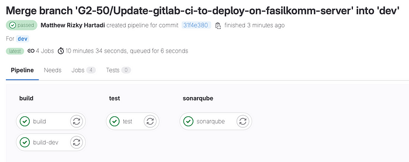

GitLab’s CI/CD integration is the real magic wand in our toolkit. With it, we effortlessly automate the often time-consuming tasks of testing and code deployment. Here’s how the magic unfolds: when a developer makes changes and pushes them to GitLab, the CI/CD pipeline will run. Like a tireless assistant, it runs a series of tests to ensure our code remains robust. The CI/CD pipeline can have many stages such as 1) build: where it will build the app, 2) test: will run series of tests (unit, integration), check code quality and format, 3) sonarqube: that will run sonar scanner and push the results to sonarqube to check the code quality as well, 4) deployment: to deploy the app, and you can add few more. This automation not only saves us countless hours but also minimizes the risk of human error, ensuring that our code stays in impeccable shape.

## **Merge Request**

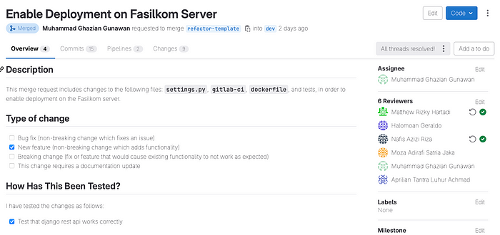

In the world of software development, collaboration is the key. GitLab’s Merge Request feature emerges as our collaborative backbone. It allows us to seamlessly merge code from different branches, a crucial step in the development process. When developing a PBI, each PBI is developed in it’s own branch, then after it’s done developed, those branch will be merged into dev -> staging -> then main. And in order to merge, it will go through merge request process.

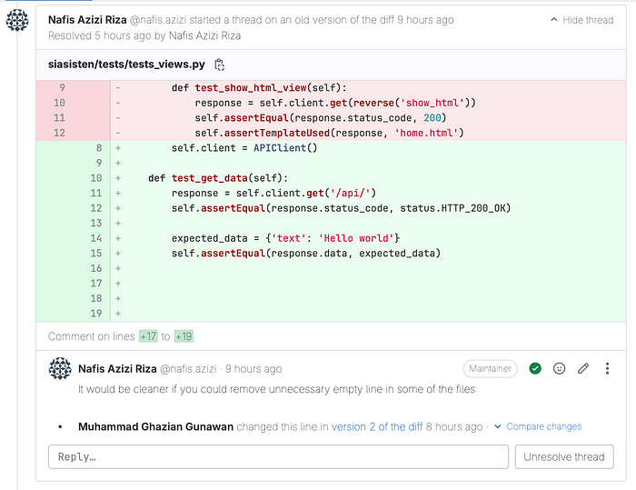

But it doesn’t stop there; it also provides a safety net for code reviews. Before the big merge, we can double-check that everything aligns perfectly, mitigating the risk of errors and ensuring that our codebase remains strong and cohesive. In code review, reviewer can give appreciation about the changes, asking for clarity, catch any errors if any, give suggestions and many more. Merge request and code review is a very important steps in software development, so that the delivered apps quality will be maintained.

# **Jira**

As you may remember, one of the key principles of Scrum is transparency, which is crucial for a Scrum Team’s success. Transparency ensures that everyone on the team is fully informed about progress and updates. To facilitate this transparency, it’s essential to have tools that can effectively manage your Backlog, Sprints, and other critical documentation.

Jira, developed by Atlassian, is a widely used Agile team project management tool that comprehensively supports various aspects of team and backlog management. It offers customization options tailored to your team’s needs and serves as a centralized hub for all things related to your Scrum Team, including your Product Backlog, Sprint planning, and much more.

## **Managing Backlog**

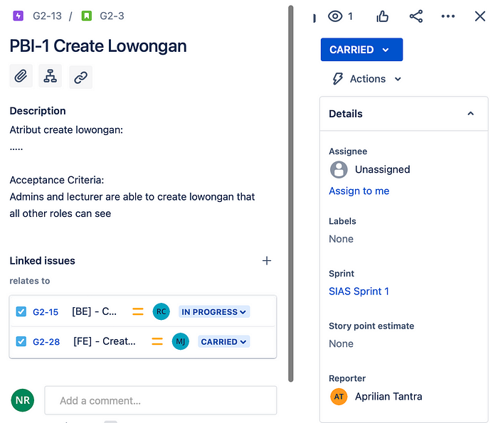

Creating and maintaining a well-organized Backlog is fundamental to any Agile project. Jira makes this process seamless and efficient. With Jira, we can effortlessly create and link our Backlog with user stories, tasks, and other work items. But it doesn’t stop there. We can add detailed acceptance criteria, estimate story points, and establish crucial links between Backlog items and other relevant issues. This comprehensive approach ensures that the Backlog becomes not just a list of tasks but a strategic plan for the project’s success.

## **Sprint Planning**

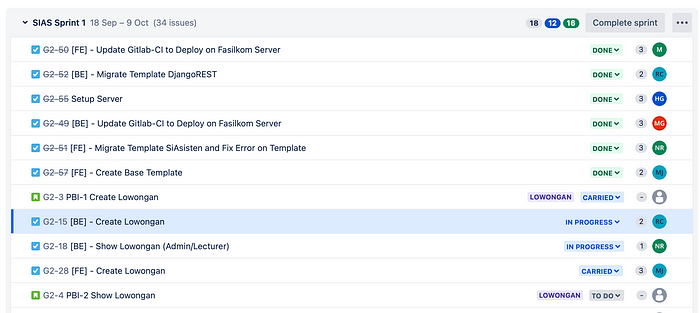

In Agile, Sprints are the heart of project development. They represent focused, time-boxed work periods during which the team tackles specific Backlog items. Jira simplifies Sprint planning by allowing to create Sprints effortlessly, set the time interval of the sprints, and make the sprint is fully customized. With a user-friendly drag-and-drop interface, you can populate your Sprints directly from the Backlog. Jira This intuitive process ensures that your team remains aligned and can quickly adapt to changing priorities.

## **Progress Tracking**

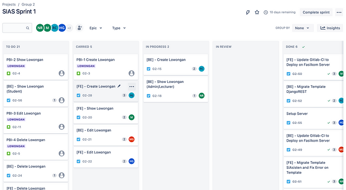

As Scrum Team embarks on the journey of each Sprint, effective progress tracking becomes crucial. Jira offers robust support for this critical aspect. You can effortlessly assign tasks to team members, ensuring clear accountability. The real-time status tracking within Jira’s intuitive interface eliminates the need for constant status meetings. Each task follows a predefined workflow, moving seamlessly from ‘To Do’, ‘Carried’, ‘In Progress’, ‘In Review’, and ultimately to ‘Done.’ This granular visibility empowers your team to make informed decisions and maintain maximum productivity.

- **To do:** represents the starting point of a task or user story within a Sprint. This is where ideas and requirements are initially collected and prioritized. During this phase, the team identifies which items from the Backlog will be addressed in the current Sprint. Tasks in the “To Do” stage are like a blank canvas, awaiting assignment to team members and further details to guide them toward completion.
- **Carried:** unique feature in Jira, serving as a middle ground between “To Do” and “In Progress.” It’s where tasks that were planned for a Sprint but didn’t get started or completed reside. “Carried” items signify the flexibility of Agile methodologies, accommodating changes and unforeseen circumstances gracefully.
- **In Progress:** is the heart of the action within a Sprint. It signifies that a team member has taken ownership and is actively working on it. This phase is where the real development, coding, or implementation happens.
- **In Review:** when a task or user story has reached a critical juncture. It’s here that team members review each other’s work for quality assurance and alignment with project requirements. Merge request, code reviews, testing, and peer evaluations often occur during this phase to ensure that the work meets the team’s standards and the project’s objectives. The “In Review” status helps maintain the integrity and quality of the project.
- **Done:** represents task completion. When an item reaches this phase, it signifies that all work associated with it has been finished, and it meets the predefined acceptance criteria.

# **SonarQube**

SonarQube is an open-source platform developed by SonarSource for continuous inspection of code quality. Sonar does static code analysis which provides a detailed report of bugs, code smells, vulnerabilities, code duplications. It supports almost 27 major programming languages through built-in rulesets and can also be extended with various plugins.

## **Code Analysis**

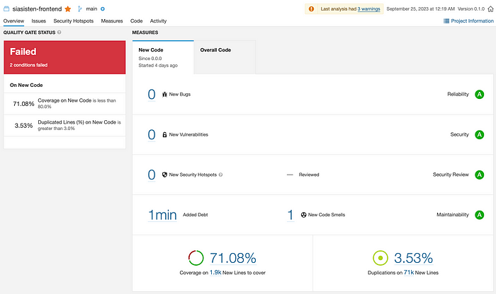

At its core, SonarQube is an automated code analysis platform that excels at pinpointing code quality issues and vulnerabilities. It’s like having an experienced code reviewer who never sleeps, constantly examining your code for potential problems. Whether it’s detecting code smells, identifying duplications, or assessing compliance with coding standards, SonarQube has your back.

## **Code Smell**

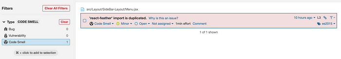

Code smells are subtle signs of deeper issues in the codebase, and they can be quite difficult to spot manually. One of SonarQube advantages is at detecting these code smells and providing actionable insights on how to eliminate them. It’s like having a mentor who not only points out the problems but also offers guidance on how to fix them. This helps keep your codebase clean and maintainable, reducing technical debt and ensuring long-term project health.

## **Duplicated Code Block**

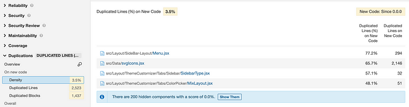

Remember DRY — Don’t Repeat Yourself? Duplicate code can be a silent killer, leading to maintenance nightmares and bug-ridden software. SonarQube acts as the code copy-paste detector, identifying duplicated code blocks and highlighting where the redundancy lies.

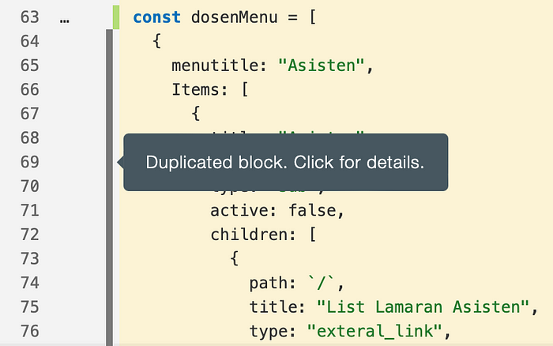

This not only helps in eliminating unnecessary code but also improves code maintainability and reduces the risk of introducing bugs during future changes.

# **Prettier — VSCode Extension**

In the realm of software development, consistency is the key of maintainable and readable code. Prettier VSCode extension, is a crucial tool that has become our secret sauce for achieving uniform code formatting and enhancing code readability within our team.

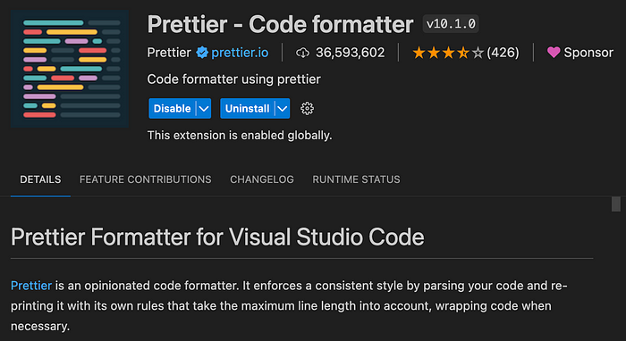

Prettier is like a magic wand for code formatting. It ensures that every line, indentation, and code structure adheres to a consistent style guide, leaving no room for formatting discrepancies. This uniformity not only makes our code visually pleasing but also simplifies collaboration within the team. With Prettier, debates about code formatting become a thing of the past, allowing our developers to focus on what matters most: writing clean and functional code. Moreover, the extension seamlessly integrates with Visual Studio Code, making it an accessible and indispensable tool for every team member. Whether you’re writing JavaScript, TypeScript, HTML, CSS, or a variety of other languages, Prettier ensures that code remains consistent and easy to read, promoting a harmonious development environment and boosting overall productivity.

# **Issues & Challenges Along The Way**

At the end of the day, tools is just a tools. Although it could help to improbe the productivity and efficiency, it has limitations and none of them are one perfect thing that can solve all your problems. As I used the tools that I’ve mentioned above, there are some issues that hinder the team’s works and pushed back our deliverables.

1. Gitlab: gitlab that we used is using enterprise edition from our faculty and the runner is built on the faculty’s server. Few times we had our pipeline failing due to the server’s problem and some of others things of the pipeline issues that we can’t resolve and out of our control. One time we had a very strange situation when the code is completely the same but the pipeline run on different branch, and one of them was failing while the other was passing.
2. Jira: at the first stage of the sprint, the teams and the teaching assistants decided using Jira as our PM tools, however after the second sprit (around 1 month after), we realized that the Jira plan that we used is free plan and only lasts 1 month. After that, we have to pay subscription to continue using Jira. As a student who clearly don’t want to put money out of our own pocket, we decided on using the other tools. What’s the catch? we lost all of our sprint data including backlog, burden charts and all other PM related things in Jira. We decided to migrate to clickup. However, clickup has some issues while the concurrency of the app is not as great as Jira. Sometimes, the data that we input in the app, need some minute to be appear in other people account. This also really hinder our works.

While having these two issues, we managed them and survived the development process!! The first problem is really out of control, the things that might resovle the problems is to build our own runner to make sure the pipeline pass.

On the other hand, there are several options to resolve. First, pay the subscription for the Jira so that we can continue on using it and not losing our data. Second, we have to do research about the tools that we’ll use in the development, including the pricing plan, and the quality of the app. We realized that trello is one of the free app that have a great quality, but we found out quite late and if we decided to migrate to trello, it won’t worth the hustle.

# **Conclusion**

As I wrap up our exploration of essential tools in the realm of software development, one thing becomes abundantly clear: these tools are the unsung heroes that transform the chaos of coding into collaboration and efficiency. Our journey with SIASISTEN, the teaching assistant hiring management app, has been a testament to the transformative power of these tools.

However, this journey has not been without its challenges. Learning to utilize the full potential of these tools required dedication, patience, and a commitment. Integrating these tools seamlessly into our workflow was a process that demanded time and effort. But in the end, the results have been more than worth it. SIASISTEN has evolved into a robust, efficient solution, thanks in no small part to the support and capabilities of these essential tools.
