Hey there, fellow devs! Today, we’re going to dive into the world of Test-Driven Development (TDD) and how we’re using it to supercharge our teaching assistant hiring management platform, SIASISTEN. Whether you’re an expert developer or just starting your coding journey, TDD is a concept that can revolutionize the way you approach your projects. TDD might sound like just another buzzword, but trust me, it’s a game-changer. Let’s break it down!.

# **What‘s TDD?**

It stands for Test-Driven Development, which is a software development approach that flips the traditional coding process on its head. Instead of writing code first and then testing it, we write unit tests before we even start coding. These tests define the expected behavior of our code. Then, we write code to make those tests pass. It’s like having a roadmap before embarking on a journey.

# **Red, Green, Refactor**

TDD has this nifty mantra: RED, GREEN, REFACTOR. What does that even mean? Let’s demystify it.

## **RED**

Imagine you’re in the ‘red’ zone, indicating something’s wrong. In TDD, this means writing a test that defines what your code should do. This test fails initially because, you haven’t written the code yet. It’s your wishlist, your dream feature encapsulated in code.

## **GREEN**

The soothing ‘green’ light, signifying all systems go. In TDD, this phase involves writing the minimum code necessary to pass the test you wrote in the RED phase. It’s the thrill of seeing your test turn green, indicating your code works as intended.

## **REFACTOR**

Now that your test is green, it’s time to put on your architect hat. REFACTOR means cleaning up your code without changing its behavior. It’s like tidying up your room after a party, ensuring everything is in its place. This step is crucial for maintaining a clean, efficient codebase.

# **How We Implement RED, GREEN, REFACTOR in SIASISTEN**

At SIASISTEN, RED, GREEN, REFACTOR is our guiding principle. We’ve seamlessly integrated this approach with Python Django REST Framework, our trusty backend API app. Here’s how we work with TDD:

## **Writing Unit Test First**

Before a single line of code is written, we put on our testing hats. We create comprehensive unit tests that outline the expected behavior of the feature or function we’re working on. These tests become our guiding light, our roadmap for the development journey.

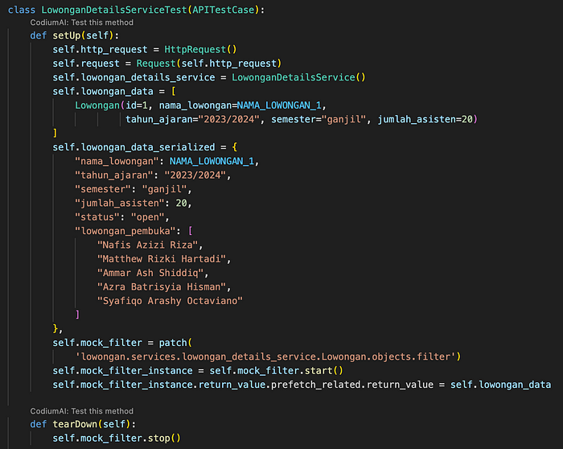

Here’s one of the example of the test to get the details of lowongan. Inside the class, the setUp method is used in order to prepare anything that will be used for the testing. In this case, I prepared the Service instance, data that need to be added, expected returned data and the mock that will be used by multiple test. Then, tearDown will be executed after all the test has been run. In this case, I stop the mock.

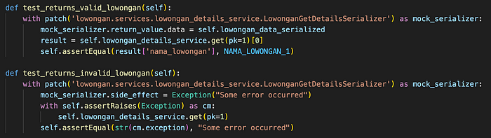

Then I wrote test cases both when it return valid and invalid lowongan. I’d like to test whether the output returned is as I expected or not. In the valid test case, I compare it with the data field, in this case the name_lowongan. And in the invalid test case, it will expect to raise exception and return Error with message “Some error occurred”.

## **Failing Test**

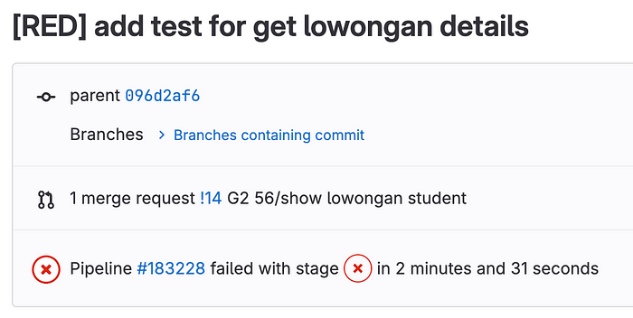

In order to run the test, run `python manage.py test <app_name>` . When we run these tests initially, they fail because we haven’t write any code yet. And guess what? That’s absolutely okay! This failing test serves as our RED light, indicating that our code doesn’t meet the expected behavior. We commit and push at this stage, and our GitLab pipeline faithfully echoes the red signal, highlighting the failing test.

Don’t forget to use “[RED]” prefix for the failing test in your commit so that the other developer can easily know the context of the commit.

## **Writing Minimal Code to Pass the Test**

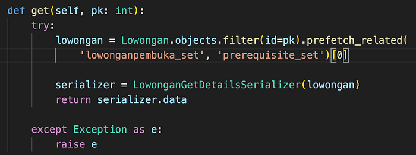

Now comes the GREEN phase. We write the minimal code required to make the failing test pass. It’s not about writing the entire feature; it’s about writing precisely what the test demands. This focused coding ensures our codebase stays lean and targeted.

Above, I wrote a minimal code so that the tests are passed. It will returned the valid data when the serializer return the data, and will raise Exception when the serializer have error.

## **Passing Test**

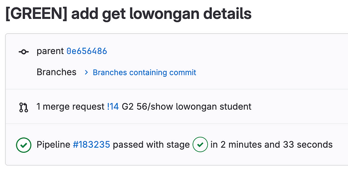

After writing the minimal code, we rerun the test. When it passes successfully, commit this successful version of the code and push it to our repository. Our GitLab pipeline will turns GREEN too, signifying the success of our implementation. Remember to add “[GREEN]” prefix commit message for this phase.

## **Refactoring**

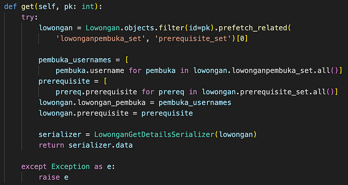

But we don’t stop there. The REFACTOR phase is where the magic happens. With a passing test as our safety net, we dive back into the code. We refactor, and optimize the code. In SIASISTEN, we usually use this phase to add more assertion, clean up the code, refactor, and add any necessary adjustment for the feature.

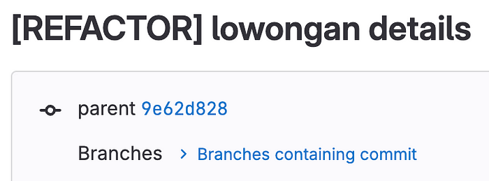

As usual, always remember to add “[REFACTOR]” as a prefix commit for this phase.

# **Unit Test in Corner Cases**

Corner case is a problem or situation that occurs only when two or more operating parameters are at extreme values, or when two or more unusual operating circumstances happen to coincide.

In SIASISTEN context, I’d like to give example on how to test the corner case when an applicants is applying for a vacancy. In order to apply for a role, they should enter their GPA that are valid in range 0–4 and consist of 3 digits with two decimal places. Some of the scenario of the corner case here is to test when the application get the GPA in string or decimal/float, and the value itself. For string format, it could be easily detect the number of digits and decimal places. But for the decimal/float, it can be a bit trickier since the extreme values could be quite interesting such that (3.999999999 -> with a lot of recurring .999). Thus, the program will round that number. Some of the test cases are:

- Float type, value = 3.99999….9999

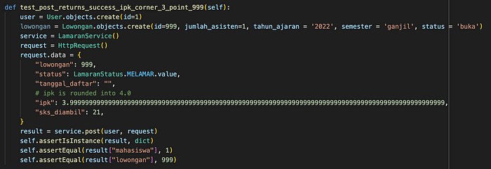

The test should pass since it will be rounded into 4.0 and it’s a valid value

- Float type, value = 4.0000…..001

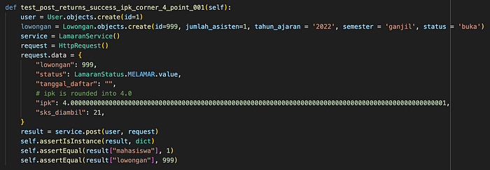

- Integer type, value = 0

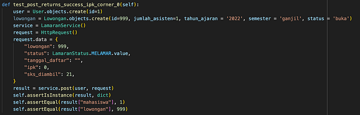

- Float type, value = 0.00….00

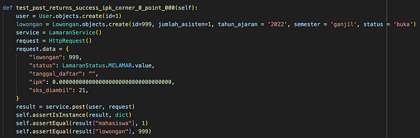

- Float type, value = 4.099…99

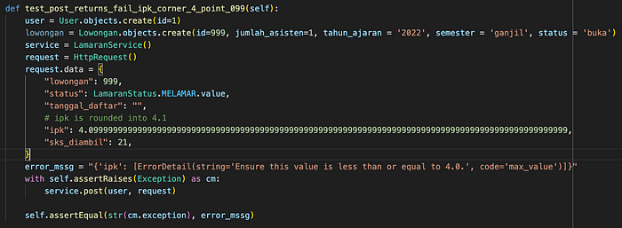

- Float type, value = -0.00…001

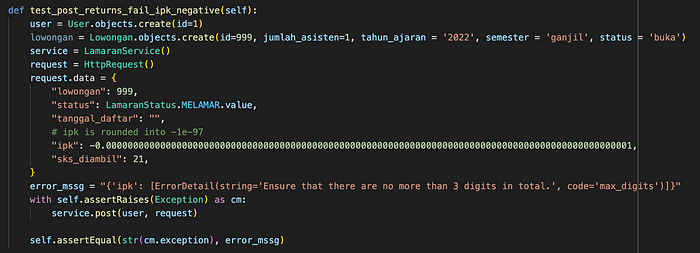

Python will round the GPA into scientific notation (=-1e-97) and it’s violating our constraint that it should max into 3 digitst. The test should fail

- String type, value = “-0.01” (3 digits, 2 decimal places, but negative)

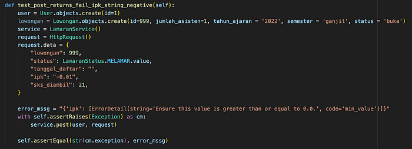

- String type, value = “0.000”

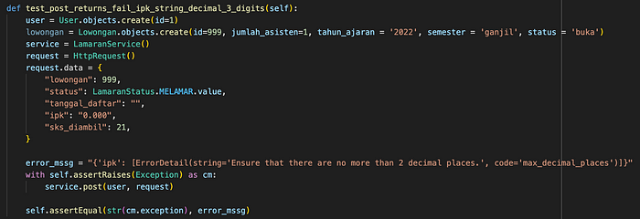

Testing the string is pretty straight forward, it have more than 2 decimal places, it should be fail!

Those are some of the example of corner cases, and it is a useful approach that your program could handle various cases including the corner cases. Remember, 100% code coverage doesn’t means that your code is bug free! it’s very depends on the test that you wrote. Writing a comprehensive test is the key!

# **Advantages of TDD**

## **Bug Prevention, not Detection**

With TDD, we can catch bugs before they even become bugs. Writing tests first means we think about the functionality and edge cases upfront. This proactive approach reduces the chances of bugs creeping into our code, which is a win-win for dev team and users.

## **Never Afraid to Refactor**

Ever hesitated to refactor code because you were afraid of breaking something? TDD eliminates that fear. With a comprehensive suite of tests in place, you can confidently refactor and improve your codebase without worrying about introducing new issues.

# **Challenges I Ran Into**

## **Shifting Mindset**

Yes, RED, GREEN, REFACTOR is quite something new to me. I mean.., writing the test first then the code!?? What kind of test should I wrote?? Usually as a developer who write the code first then the test, it more likely you solve a problem. But if you write the test first, is something similar like you have to discover the problem first. Shifting mindset isn’t always easy, but once you grasp the concept, you’ll wonder how you ever coded without it.

# **Conclusion**

In the dynamic realm of software development, RED, GREEN, REFACTOR stands tall as a beacon of quality and collaboration. At SIASISTEN, it’s not just a methodology — it’s our mantra. It guides us, shapes our code, and fosters a sense of unity among our team members.

So, whether you’re a newbie eager to learn or a seasoned coder seeking a fresh approach, give TDD a shot. It’s not just a coding strategy — it’s a mindset that transforms the way you make software. Start with that first RED test, watch it turn GREEN, and then polish it with REFACTOR. Your codebase will thank you, and you’ll wonder how you ever coded any other way. Happy coding, cheers! 🚀
