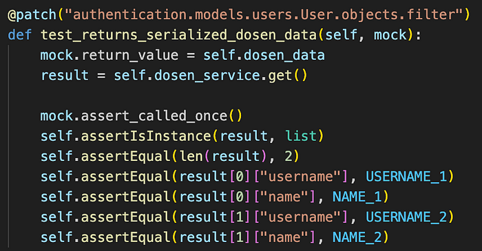
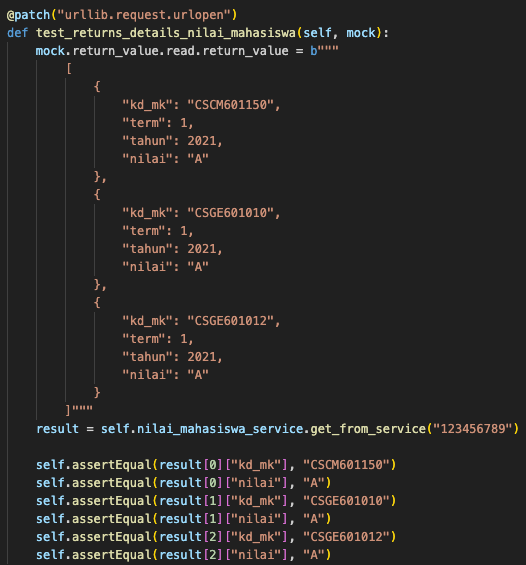
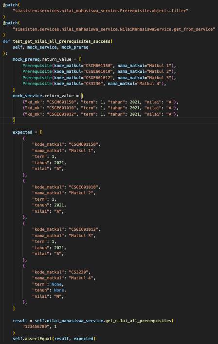
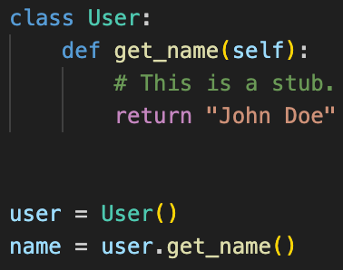
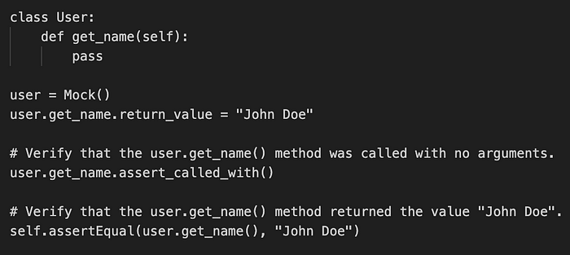
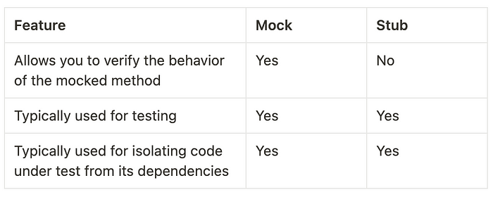

Hey there fellow developers! In the domain of software development, ensuring the reliability and functionality of your app is essential key. This article will delve into the concepts of mock objects and stubs in software testing and it’s implementation in Django REST Framework.

# **What is Mock Or Stub?**

## **Mock Objects**

Mock objets are fake objects that can be used to subtitute real objects in your testing. They are typically used to simulate the behavior of external resources, such as database or web services. Mock can be used to:

- **Isolate testing**: Mock objects can be used to isolate test from its dependencies. This is very useful in unit testing! As you know, unit testing is used to test the smallest piece of code, and isolating from it’s dependencies is very important because you only need to test the behaviour of the function itself (not the external dependencies). This makes it easier to test the code and verify that it is working correctly.
- **Simulate errors**: Mock objects can be used to simulate errors that might occur in real-world applications. This allows to test the code ability to handle errors in a smooth way.
- **Verify behavior**: Mock objects can be used to verify the behavior of the code while testing. For example, you can use a mock object to verify that the code is calling the correct methods with its dependencies.

## **Stub**

On the other hand, stub objects are a type of mock that provides a canned response to method calls. This can be useful for testing code that depends on the behavior of specific objects. Usually, stub is used for simpler behavior. Stub typically used to:

- **Simulate simple behavior:** Stub objects can be used to simulate the simple behavior of real objects. This can be useful for testing code that depends on the behavior of simple objects.

# **Test Isolation**

Test isolation is a testing technique that involves testing individual units of code in isolation from other units of code. This can be achieved by mock and stubs to simulate the behavior of external dependencies. It has several benefits such as:

- Make test easier to write and maintain: Isolates tests are typically easier to write and maintain than tests that depend on external resources.
- Makes test more reliable: Isolated test are less likely to fail due to changes in external resources.

# **Mocking in Django REST Framework**

In this example, I will use a code snippet from my Software Engineering Project, SIASISTEN that is developed using Django REST Framework.

In the code provided above, it uses mock. The `@patch("authentication.models.users.User.objects.filter")` decorator is used to mock the `User.objects.filter()` method. This means that when the `get()` method of the `dosen_service` object is called, the `User.objects.filter()` method will not be actually called. Instead, the mock object will be called and will return the `dosen_data` list.

This allows the test to isolate the `get()` method from its dependency on the `User` model. This makes it easier to test the `get()` method and to verify that it is working correctly.

# **Stub in DRF**

Above, is one of the example of stubbing external service API. I’d like to set predefined return value when calling the external API and then after I call the method I would like to test, I can assert the values.

If in the first example I stubbed the external API, here I set predefined value when the program is trying to fetching the data from the database. Unit test should isolated, hence I set predefined value when the program trying to fetch data from database. In this case, I set the return value to be the list of prerequisites that I want to get the score of the applicants.

## **Well now you might be confused, why those code is mock, not stub?**

The code example above is not a stub because it allows to verify the behavior of the mocked object. In other words, you can verify that the mocked object was called with the correct arguments and that it returned the correct value.

A stub, on the other hand, is a simpler type of mock object that only allows you to specify the return value of the mocked object. You cannot verify the behavior of a stub in the same way that you can verify the behavior of a mock.

Here I will give you example with a very simple code

In this example, the `user.get_name()` method is a stub. It always returns the value "John Doe". You cannot verify that the `user.get_name()` method was called with the correct arguments or that it returned the correct value.

Here is an example of a mock:

In this example, the `user.get_name()` method is a mock. It is configured to return the value "John Doe". You can also verify that the `user.get_name()` method was called with the correct arguments and that it returned the correct value.

In general, it is recommended to use mocks instead of stubs when testing software. This is because mocks allow you to verify the behavior of the mocked object, which can help you to identify and fix bugs.

Here is a table that summarizes the key differences between mocks and stubs:

# **Conclusion**

Mocking and stubbing might be a little bit confusing concepts. However, it provides a powerful tools that isolates the test and ignore the dependencies while testing, but also can add complexity to the code. Please to aware the usage of mock and testing and make sure the test that you write is clean and efficient, so that it can make easier for the other developer to read your code.
