Hi there fellow designers and developers! Today let’s talk about visual designs, wireframes, mockups, Nielsen’s 10 Usability Heuristics and many more related to the visual design.

Visual design is a critical aspect of any software application, in our software engineering project, SIASISTEN, a well designed UI can make it easy for users to find the information they need and complete tasks efficiently.

# **Wireframe and Mockups**

Creating wireframes and mockups is a great way to start the visual design process. Wireframes are low-fidelity sketches that focus on the layout and structure of the UI. Mockups are high-fidelity designs that provide a more realistic look and feel of the final product.

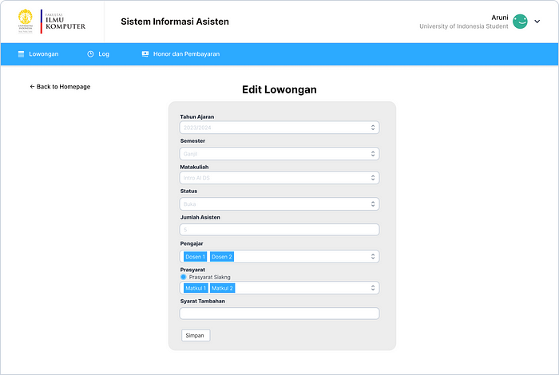

During the development, our team decided to create the mockup directly to save some times because we have limited amount of time back then. Hence, example above is the mockup of the SIASISTEN.

When designing wireframes and mockups for SIASISTEN, it is important to keep Nielsen’s 10 usability heuristics in mind. These heuristics are a set of general principles for designing user interfaces that are easy to use and understand.

# **Nielsen’s 10 Usability Heuristics**

**1. Visibility of system status:** Users should always know what is going on inside the system, through clear and appropriate feedback.

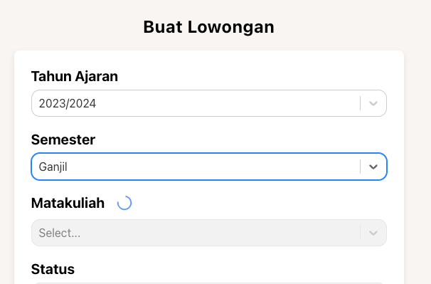

As image above, there is a loading spinner that will give user’s the current of the system status when it tries to fetch the list of courses. This examples shows that user know that the application tries to process or load data.

**2. Match between system and the real world**: The system should use the language, concepts, and metaphors that are familiar to users, rather than system-oriented terms. Follow real-world conventions, making information appear in a natural and logical order.

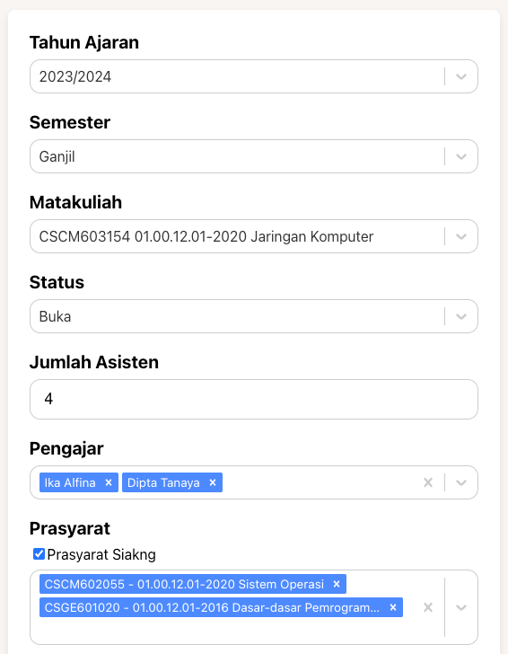

In the picture above, all the language are consistent using Bahasa and it use metaphor and concepts that are familiar to the users. For example, in the semester, instead of using semester 1, 2, and 3, it use ganjil, genap, and pendek as the user is more familiar to that concepts.

**3. User control and freedom:** Users often choose system functions by mistake and will need a clearly marked “emergency exit” to leave the unwanted state without having to go through an extended dialogue. Support undo and redo.

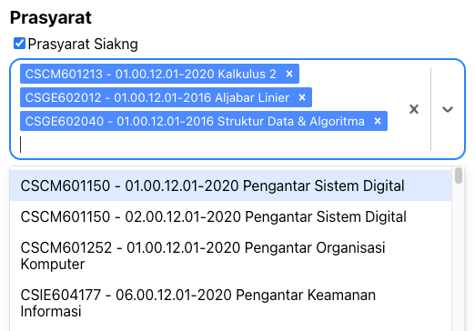

As example above, user could add any of the courses and delete them as they want. The application do not force the user to always fetch the courses from the official academic system. This give users a lot of control and freedom.

**4. Consistency and standards:** Users should not have to wonder whether different words, situations, or actions mean the same thing. Follow platform conventions.

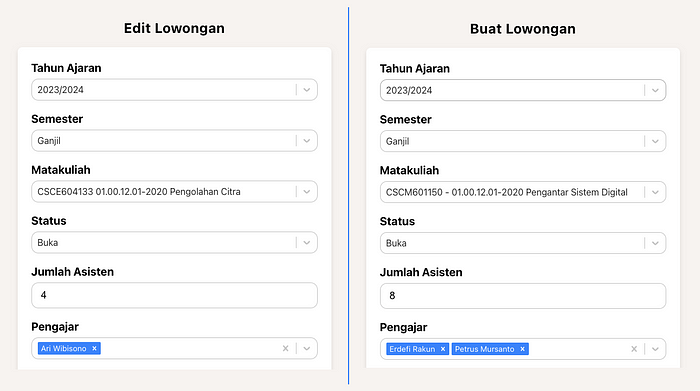

In the picture above, we can see that for different pages (create and edit lowongan), the terms, languages, design styles are following the same patterns. The functionality of each fields are also the same. This keeps the consistency and standards of the apps.

**5. Error prevention:** Even better than good error messages is a careful design which prevents a problem from occurring in the first place. Either eliminate error-prone conditions or check for them and present users with a confirmation option before they commit to the action.

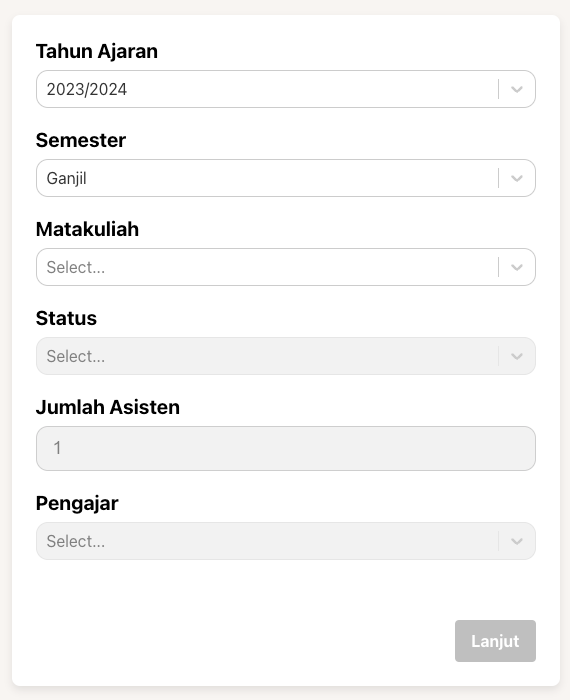

In the example above, it tells that if user’s haven’t done filling all the required fields, the next button is disabled and preventing users to perform any errors. This shows that by disabling the button, it will prevent the error even before they commit the actions of creating the lowongan.

**6. Recognition rather than recall:** Minimize the user’s memory load by making objects, actions, and options visible. The user should not have to remember information from one part of the dialogue to another. Instructions for use of the system should be visible or easily retrievable whenever appropriate.

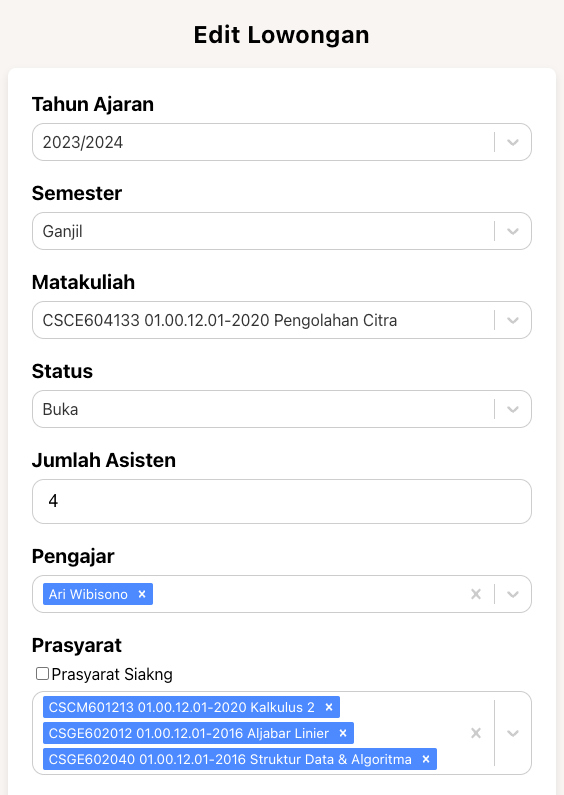

In the example above, when editing the lowongan, user do not need to remember what are the fields that is already filled in before. The system will display all the filled fields so that user do not need to remember and it can reduce user’s cognitive.

**7. Flexibility and efficiency of use:** Accelerators — unseen by the novice user — may often speed up the interaction for the expert user such that the system can cater to both inexperienced and experienced users. Allow users to tailor frequent actions.

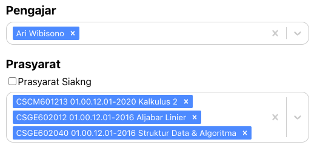

Some of the frequent actions that might occur are when user want to select some courses that are prerequisite for a particular course. Novice user might not seen the shortcut for automatically fetching all the prerequisite, and select them one by one.

**8. Aesthetic and minimalist design:** Dialogues should not contain information which is irrelevant or rarely needed. Every extra unit of information in a dialogue competes with the relevant units and diminishes their relative visibility.

As we can see, the design above are minimalist and all contents only contain that relevant. There is no any irrelevant information that being on display, keeping the interface minimalist and aesthetic.

**9. Help users recognize, diagnose, and recover from errors:** Error messages should be expressed in plain language (no codes), precisely indicate the problem.

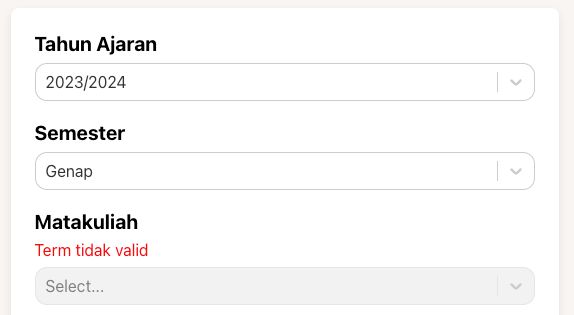

Example above shows that it will display error messages when user are choosing the invalid term. The error messages are display in aplain language and understandable for the users. This suggest user to choose the term that are valid so that they can continue to choose the course.

**10. Help and documentation:** Even though it is better if the system can be used without documentation, it may be necessary to provide help and documentation. Any such information should be easy to search, be focused on the user’s task, list concrete steps to be carried out, and not be too large.

# **Best Practice Visual Design Guidelines**

Some of the best practice for the visual design guidelines are:

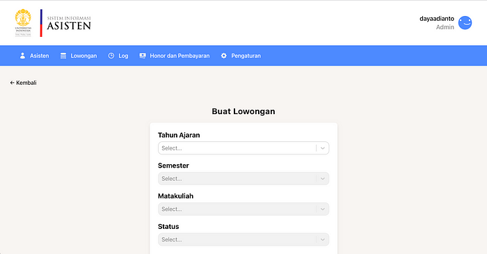

- Use consistent typography and colors throughout the UI. This is really important in order to follow the Nielsen’s Heuristic and make the interface comfortable to the users. consistent typography and colors will create a harmony to the user’s visual.
- Make sure all UI elements are large enough to be easily tapped or clicked. As most of the UI element’s purposes are to have interaction with users, make sure that they are large enough so that user can easily tap or click.
- Use white space effectively to make the UI look less cluttered and more inviting. White space is also very important when dealing with visual design. With considering the right amount of whitespace, it will lead the user’s focus into a particular area that are important. Rather than cluttered interface that make user’s confuse on which part of the interface they need to be focus on.

# **Alternative Design**

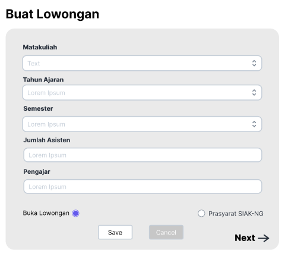

From the previous mockup for the create lowongan, I provide alternative design that the status of the lowongan is made as dropdown instead od radio button. Also the pengajar fields are need to be multiselect and not typed manually by the users.

Design 1 (top), Design 2 (bottom)

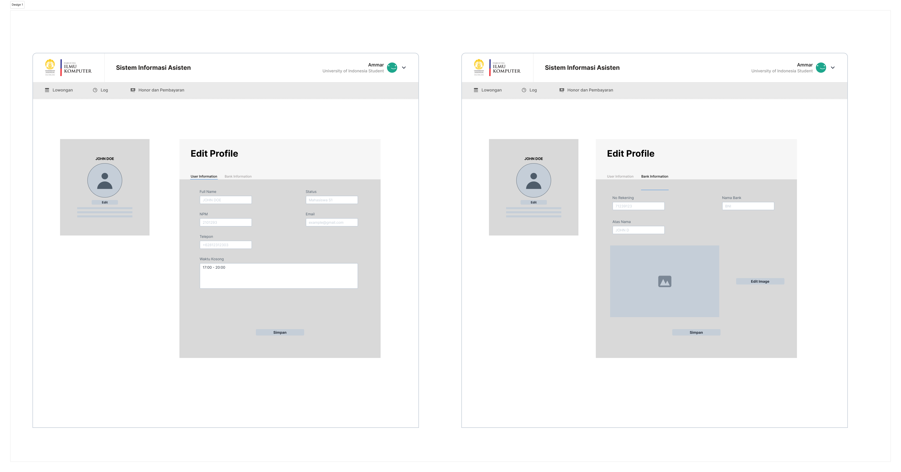

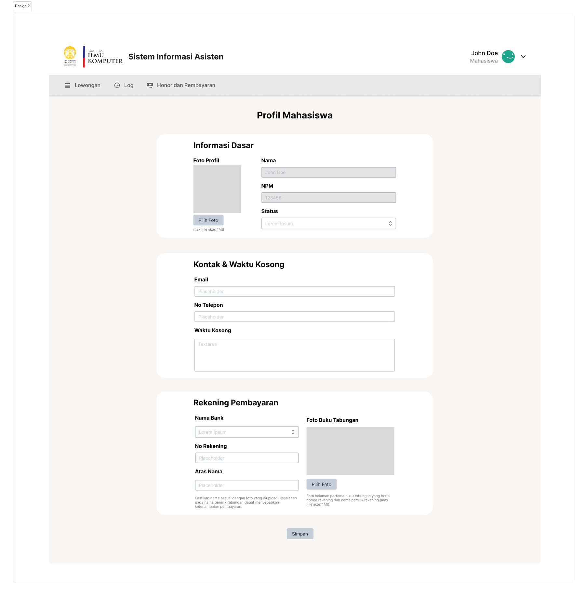

Above is also an example of alternative design that I’ve made. In update profile page, the goal is that user be able to update their profile and recall their profile information if needed. The first design was designed by other team mates and the second one was designed by myself.

From my evaluation and perspectives, design 1 has some downsides such as, the information shown are only categorized by tabs (user information and bank information). In order to see/update each information, user need to move into particular tab and edit them. This could be decrease the user experience if they updating their information, remember that Nielsen Heuristic suggest recognition rather than recall. Second one, the profile picture on the left grid take only a little space and left with a lot of whitespace. This could reduce the minimalistic and aesthetic of the design.

Hence, I made alternative design by addressing the issues. Rather than separating the tabs, I divide them (informasi dasar, kontak & waktu kosong, and rekening pembayaran) into several containers and display them at once. The profile picture was placed inside the informasi dasar container. Here, user do not need to click between tabs in order to get the necessary information and the whitespace are minimal. The design looks elegant and aeshtetic.

By providing alternative design, it could help to develop an interfaces that do a better job of meeting the requirements than the existing solutions.

# **Challenges Along The Way**

In the beginning of the sprint, we discussed about the wireframe and the mockups, we provide feedbacks and take inputs from the stakeholders. However, since developing an app is a long iterative process. The changes and feedbacks that are given along the process are typically given during the sprint review. This will make the fix and minor adjustment done in the next sprint and it looks like the process take quite a long time.
