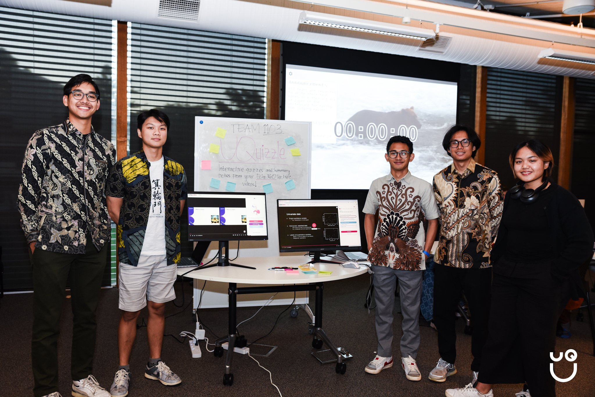
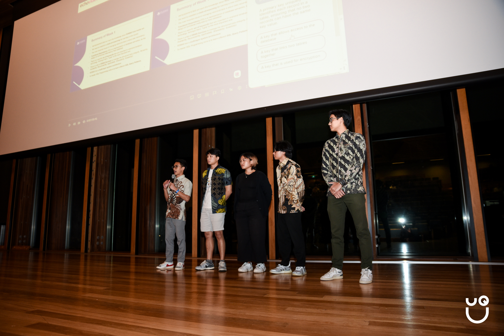

As a CS student, I've always been passionate about finding ways to improve the learning experience through technology. This drive, combined with an unforgettable hackathon experience, led to the creation of UQuizzle – a Chrome extension that transforms how students interact with lecture recordings on Echo360.

## The Birth of UQuizzle

When we walked into the UQCS Hackathon 2024, we had nothing but enthusiasm and empty notebooks. No predetermined ideas, just a shared passion for creating something meaningful. The first night was filled with intense brainstorming sessions as we sought to identify a problem worth solving. As students ourselves, we kept coming back to a common pain point: the challenge of going to lectures, staying engaged with lecture recordings and effectively retaining information.

The idea for UQuizzle emerged from our collective experiences. We knew that for our project to succeed, it needed to be both innovative and feasible within the hackathon's time constraints. After thorough feasibility checks and technical discussions, we committed to our vision to build an AI-powered tool that would make lecture recordings more interactive and engaging.

What followed were intense, sleepless nights on campus. Our diverse team – myself, Ammar, Azra, Matthew, and Syafiqo – worked tirelessly, each bringing our unique strengths to the table. The supportive atmosphere of the hackathon, combined with our determination, pushed us through the challenging moments. These experience became some of our most memorable university experiences.

## The Solution

UQuizzle seamlessly integrates with Echo360's video player, transforming passive video watching into an active learning experience. At its core, the extension provides intelligent quiz generation, analyzing lecture content in real-time to create relevant multiple-choice questions. Each question includes a timestamp link, enabling students to jump directly to the relevant part of the lecture for review.

We didn't stop at quizzes. Our AI-powered system converts lecture content into concise, downloadable notes, saving students valuable time while ensuring they don't miss crucial information. The system provides personalized performance analytics, offering topic-by-topic strength analysis and tailored improvement recommendations.

Building UQuizzle presented unique technical challenges. We chose JavaScript as our primary technology, integrating it with OpenAI's API for content analysis and generation.

## Impact and Recognition

Our hard work paid off in ways we never expected. UQuizzle won Best Overall at the UQCS Hackathon 2024, standing out among many impressive projects. This recognition validated our belief that sometimes the most impactful solutions come from addressing everyday problems that affect many students.

The positive feedback from fellow students has been particularly rewarding. Hearing how UQuizzle could helped them engage better with lecture content and improve their study efficiency makes all those sleepless nights worth it.

While we're proud of what we've built, we see UQuizzle as just the beginning. We’re planning to work on expanding its capabilities, and publish it so that everyone can use it. The project remains open-source, inviting the community to contribute to its growth.

For those interested in trying UQuizzle, the setup is straightforward. After cloning the repository and installing dependencies, you'll need to add your OpenAI API key. Within minutes, you can transform your lecture experience into an interactive learning journey.

## Conclusion

Creating UQuizzle has been more than just a hackathon project – it's been a journey that combined technical innovation with real-world impact. As a Computer Science student focusing on software engineering and AI, this project perfectly aligned with my interests while solving a genuine problem faced by students.

The hackathon experience taught us that with determination, teamwork, and lots of coffee, it's possible to create something meaningful in just a few days. As we continue to develop and improve UQuizzle, we remain committed to our original goal: making learning more engaging and effective for students everywhere.

The success of UQuizzle at the hackathon was just the beginning. We're excited to see how it will continue to evolve and help students make the most of their lecture recordings, one video at a time.
